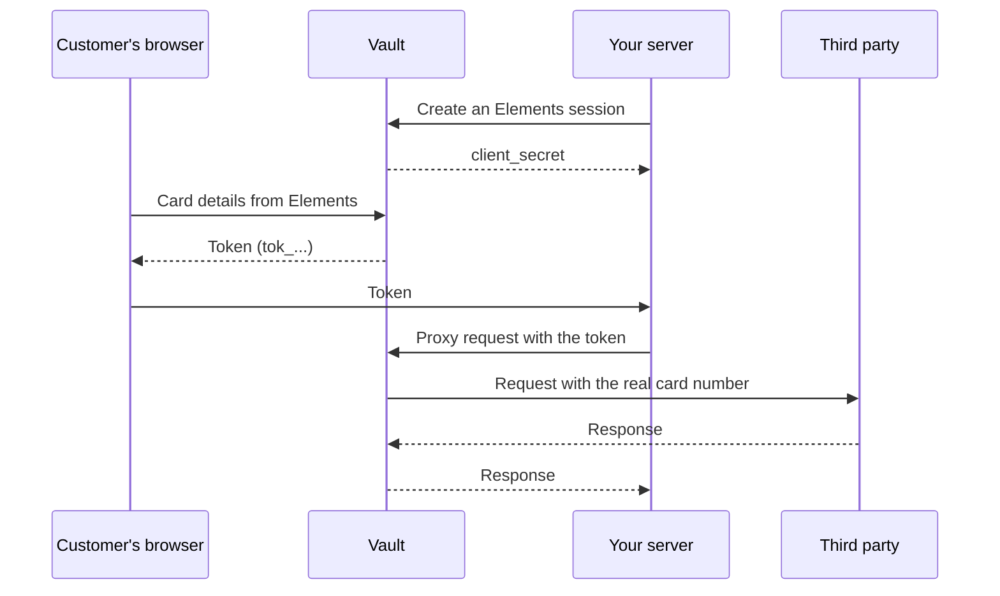

import { KeyRound, Route, ShieldCheck, TextCursorInput } from 'lucide-react';

<Callout type="warn">
Vault is in alpha. There are no Vault fees during alpha.
</Callout>

Vault stores card details, bank details, and other sensitive data. It gives your application a **token** that refers to the saved data. You store that token in your database and use it in later requests.

Use **Elements** to collect data directly from the browser and the **proxy** to send it to a payment processor or another service. This lets your application work with tokens without collecting the raw values itself.

You can also create tokens from your server or retrieve raw values with a **reveal** request. Those paths expose the data to your server and need the appropriate permissions and handling.

## How it works



1. Your server creates a **session** that lets the browser save one token.
2. The customer enters their details in **Elements**, which sends them directly to Vault.
3. Vault returns a **token**. Your page sends the token ID to your server to save.
4. To use the saved data, your server sends a request through the **proxy**. Vault replaces token references with their values before forwarding the request.

<Cards>
  <Card title="Tokens" icon={<KeyRound />} href="/v2/workspace/vault/tokens">
    Create, retrieve, update, and delete tokens.
  </Card>
  <Card title="Elements" icon={<TextCursorInput />} href="/v2/workspace/vault/elements">
    Collect cards and sensitive data in secure fields on your page.
  </Card>
  <Card title="Proxy" icon={<Route />} href="/v2/workspace/vault/proxy">
    Send tokenized data to third parties without handling it yourself.
  </Card>
  <Card title="Access and security" icon={<ShieldCheck />} href="/v2/workspace/vault/access-and-security">
    Keys, permissions, access logs, and errors.
  </Card>
</Cards>

## Terms used in these guides

| Term | What it is |
| --- | --- |
| Token | An ID that refers to data stored in Vault, such as a card. Your application stores it in place of the raw data. |
| Mask | The non-sensitive part of the data returned with a token, such as a card's last four digits. |
| Fingerprint | A value that's the same for every token holding the same data, so you can spot duplicates. |
| Session | A short-lived credential that lets Elements create one token from the browser. |
| Elements | Secure input fields you embed on your page to collect data. |
| Proxy | Forwards your request to a third party and replaces tokens with their data on the way. |
| Reveal | Returns a token's raw data to a server with permission to see it. |

## Requests and responses

Each Workspace can have one or more vaults. Every request identifies both the Workspace and the vault:

```
https://api.pandabase.io/v2/workspaces/{workspace_id}/vaults/{vault_id}
```

Add the paths in these guides, such as `/tokens`, to that URL. For server requests, authenticate with a secret key and use `Content-Type: application/json` when sending JSON:

```sh
curl https://api.pandabase.io/v2/workspaces/wks_01j9zk2m4p6r8t0v2x4z6b8d0f/vaults/vlt_01j9zm3n5q7s9u1w3y5a7c9e1g/tokens/tok_01j9zq3c7mfx8v2k5n6p4r8t0w \
  -H "Authorization: Bearer sk_live_..."
```

The examples use `wks_01j9zk2m4p6r8t0v2x4z6b8d0f` and `vlt_01j9zm3n5q7s9u1w3y5a7c9e1g` as the workspace and vault IDs. Replace them with your own.

- **IDs** carry a resource prefix, such as `wks_` for workspaces, `vlt_` for vaults, `tok_` for tokens, `vss_` for sessions, and `val_` for access logs.
- **Times** are RFC 3339 strings, such as `2026-09-01T12:00:00Z`.
- **Objects** include an `object` field naming their type.
- **Metadata** is a JSON object up to 16 KiB for your own attributes. Updates merge: keys you omit stay, and a key set to `null` is removed.
- **Lists** return up to `limit` items (1–100, default 25). Pass `next_cursor` as `cursor` to get the next page.

```json
{
  "object": "list",
  "data": [],
  "has_more": false,
  "next_cursor": null
}
```

## Keep data in separate vaults

A token belongs to the vault where it was created. You can't retrieve it, reveal it, or use it in a proxy request through another vault.

Use separate vaults when you need to keep collections of data apart, such as data for different products or regions. Find your Workspace and vault IDs in your Workspace settings under **Vault**.
