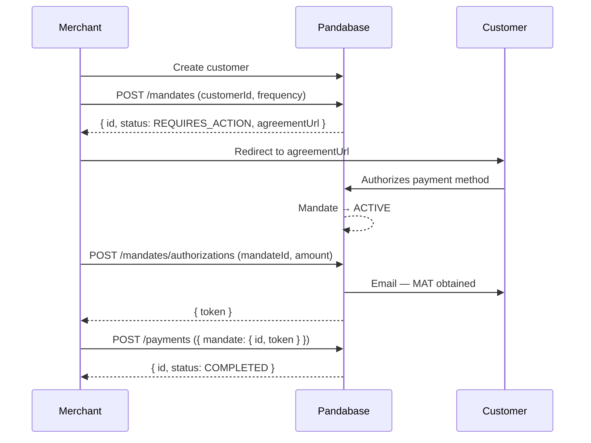

<Warning>
  This API does not exist yet. This page documents the **expected** shape and
  behavior — endpoints, fields, and flows are subject to change before release.
  Do not build against it.
</Warning>

<Info>
  Billing agreement endpoints require a scoped [API token](/developers/learn/api-tokens)
  with the `BILLING_AGREEMENTS_READ` and/or `BILLING_AGREEMENTS_WRITE`
  permissions.
</Info>

<Note>
  Internally these are referred to as **mandates**. The public-facing name is
  **billing agreements** — both terms point to the same underlying object.
</Note>

## Overview

A mandate captures a customer's authorization to charge a specific payment method on demand. The customer picks the payment method during the agreement flow; from then on you can charge it on a fixed cadence (weekly, monthly, etc.) or whenever you need to (`ad_hoc`) — without sending the customer back to checkout.

Each charge against a mandate uses a short-lived **Mandate Authorization Token (MAT)**. You request a MAT for a specific amount and reason, the customer is emailed about it, and you submit it to the payments endpoint to actually move the money.



## 1. Create the customer

Mandates are tied to a customer. Before creating a mandate, create a customer object via the Customers API and grab its `customerId` (`cus_…`).

## 2. Create the mandate

```http
POST /v2/core/stores/:storeId/mandates
```

```json Request body
{
  "customerId": "cus_...",
  "description": "describe why you want to charge them",
  "frequency": "monthly"
}
```

### Frequencies

| Value       | Cadence                                                                  |
| ----------- | ------------------------------------------------------------------------ |
| `one_off`   | A single expected charge. The mandate auto-revokes after the first success. |
| `weekly`    | One charge every 7 days.                                                 |
| `monthly`   | One charge every 30 days.                                                |
| `quarterly` | One charge per quarter.                                                  |
| `yearly`    | One charge per year.                                                     |
| `ad_hoc`    | No fixed cadence — charge whenever you need to.                          |

### Response

```json
{
  "id": "man_...",
  "status": "REQUIRES_ACTION",
  "agreementUrl": "..."
}
```

Send the customer to `agreementUrl` to authorize the mandate. Once they complete the flow, the mandate transitions to `ACTIVE` and is ready to charge. If the bank requires 3D Secure during setup, the same flow handles it — the mandate moves through `REQUIRES_AUTHORIZATION` and lands on `ACTIVE` when the customer finishes.

### Mandate statuses

| Status                   | Meaning                                                                                              |
| ------------------------ | ---------------------------------------------------------------------------------------------------- |
| `REQUIRES_ACTION`        | The customer hasn't completed the agreement yet — send them to `agreementUrl`.                       |
| `REQUIRES_AUTHORIZATION` | A 3D Secure step is required to finish setup. Pandabase handles this transparently — no work for you. |
| `ACTIVE`                 | Authorized and ready to charge.                                                                      |
| `REVOKED`                | The customer revoked the mandate. It cannot be used again.                                           |
| `EXPIRED`                | The mandate expired or the authorization timed out.                                                  |

<Note>
  You don't need to handle 3D Secure during mandate setup — Pandabase walks the
  customer through it as part of the agreement flow. 3DS may still be requested
  by the bank at charge time; see [Handling 3D Secure on charges](#handling-3d-secure-on-charges) below.
</Note>

## 3. Get a Mandate Authorization Token

Once the mandate is `ACTIVE`, request a MAT for the specific charge you're about to make. Each MAT is scoped to one charge — amount, currency, and reason.

```http
POST /v2/core/stores/:storeId/mandates/authorizations
```

```json Request body
{
  "mandateId": "man_...",
  "amount": 4999,
  "currency": "USD",
  "description": "why you want to charge"
}
```

`amount` is in the smallest currency unit (e.g. cents for USD).

### Response

```json
{
  "token": "..."
}
```

<Warning>
  Requesting a MAT emails the customer notifying them that you have obtained
  authorization to charge their saved payment method. Only request a token when
  you're ready to charge.
</Warning>

## 4. Charge the customer

Submit the mandate id and the MAT to the payments endpoint to actually charge the saved payment method.

```http
POST /v2/core/stores/:storeId/payments
```

```json Request body
{
  "mandate": {
    "id": "man_...",
    "token": "..."
  }
}
```

### Response

```json
{
  "id": "pmt_...",
  "status": "COMPLETED"
}
```

`status: "COMPLETED"` means the charge succeeded and the funds have been collected.

### Handling 3D Secure on charges

Sometimes — typically on monthly or higher-value charges — the customer's bank will challenge the payment with 3D Secure. When that happens, the response includes an `authorizationUrl`:

```json
{
  "id": "pmt_...",
  "status": "REQUIRES_3DS",
  "authorizationUrl": "https://secure.pandabase.io/bank-redirects/3ds/..."
}
```

Redirect the customer to `authorizationUrl`. Once they complete the 3DS flow with their bank, the charge automatically succeeds — you don't need to retry the request.
