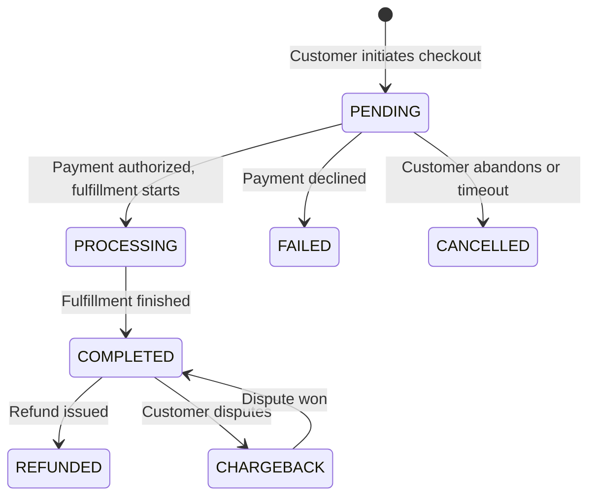

Every order in Pandabase moves through a defined set of states, and a webhook event fires on every transition. Understanding the lifecycle is the foundation for fulfillment, refund handling, and dispute response.

## Overview



## Order statuses

| Status | Description |
|--------|-------------|
| `PENDING` | Order created, awaiting payment confirmation. |
| `PROCESSING` | Payment received, fulfillment in progress. |
| `COMPLETED` | Order fulfilled successfully. |
| `CANCELLED` | Order was cancelled before payment confirmed. |
| `FAILED` | Payment was declined. |
| `REFUNDED` | A refund has been issued against the order. |
| `CHARGEBACK` | A dispute is open or the dispute was lost. |

## Payment statuses

Every order has exactly one `InboundPayment` record that tracks the payment side of the lifecycle.

| Status | Description |
|--------|-------------|
| `PENDING` | Payment intent created, awaiting customer action. |
| `PROCESSING` | Payment is being processed by the network. Common for bank-transfer methods that do not settle instantly. |
| `COMPLETED` | Payment successfully collected. |
| `FAILED` | Payment was declined or expired. |
| `REFUNDED` | The payment has been refunded. |
| `DISPUTED` | A dispute is open on the payment. |

## Lifecycle flow

### 1. Payment initiated

When a customer submits the checkout, an `Order` and `InboundPayment` are created with status `PENDING`. A `PAYMENT_PENDING` webhook event fires.

```json
{
  "event": "PAYMENT_PENDING",
  "id": "evt_abc123",
  "timestamp": "2026-05-21T12:00:00.000Z",
  "data": {
    "order": {
      "id": "ord_abc123",
      "orderNumber": "cs_abc123",
      "status": "PENDING",
      "amount": 2999,
      "currency": "USD",
      "customFields": null,
      "metadata": null,
      "items": [/* ... */]
    },
    "customer": { "id": "cus_abc123", "email": "customer@example.com" },
    "geo": null
  }
}
```

<Note>
  Geo data (`city`, `region`, `country`) may be `null` on the initial event.
  It is enriched asynchronously after checkout and is present on later events.
</Note>

### 2. Payment succeeds

Once the payment is confirmed, the `InboundPayment` moves to `COMPLETED` and the `Order` moves to `PROCESSING` while fulfillment runs. When fulfillment finishes, the order moves to `COMPLETED`. A `PAYMENT_COMPLETED` webhook event fires.

<Note>
  `PAYMENT_COMPLETED` is the primary event to listen for when fulfilling orders.
  It fires when the payment is confirmed and includes the full order payload
  including `customFields` and `metadata`. Geo data is always present on this event.
</Note>

### 3. Payment fails

If the payment is declined, expires, or the customer abandons checkout, the order moves to `FAILED` (or `CANCELLED` for explicit abandonment), the payment moves to `FAILED`, and a `PAYMENT_FAILED` webhook event fires. If a coupon was applied, its usage count is automatically restored.

### 4. Refund

When a merchant issues a refund, a `Refund` record is created. Refunds settle in one of two ways:

| Refund path | Behavior |
|-------------|----------|
| Instant | Common case. The refund completes atomically inside the request: balance is decremented, the order moves to `REFUNDED`, the payment moves to `REFUNDED`, and `PAYMENT_REFUNDED` fires immediately. |
| Async | For some payment methods the network takes time to confirm. The refund stays in `PROCESSING` until the network confirms it, at which point it transitions to `SUCCESSFUL`, the order moves to `REFUNDED`, the payment moves to `REFUNDED`, and `PAYMENT_REFUNDED` fires. |

In both cases, your handler should treat `PAYMENT_REFUNDED` as the signal that the refund is final.

### 5. Dispute

If a customer opens a chargeback with their bank, a `Dispute` record is created and the order moves to `CHARGEBACK`. The payment moves to `DISPUTED`. The disputed amount plus a $20.00 dispute fee is deducted from the store's available balance. A `PAYMENT_DISPUTED` webhook event fires.

Disputes move through several internal states:

| Dispute status | Meaning |
|----------------|---------|
| `AWAITING_REVIEW` | Dispute opened. Merchant has not yet submitted evidence. |
| `UNDER_REVIEW` | Evidence submitted. Card network is reviewing. |
| `WON` | Card network ruled in the merchant's favor. Funds restored. |
| `LOST` | Card network ruled in the customer's favor. Funds stay deducted. |
| `PREVENTED` | The card network prevented the chargeback before it became a formal dispute (Verifi RDR or Ethoca). Treated as a loss with a $30 prevention fee. |

When a dispute resolves, one of these events fires:

| Outcome | Event | Effect |
|---------|-------|--------|
| Won | `PAYMENT_DISPUTE_WON` | Disputed amount restored. Order returns to `COMPLETED`, payment to `COMPLETED`. |
| Lost | `PAYMENT_DISPUTE_LOST` | Funds stay deducted. Order stays `CHARGEBACK`. |
| Prevented | `PAYMENT_DISPUTE_PREVENTED` | Full disputed amount plus a $30 prevention fee is deducted. Order set to `CHARGEBACK`, payment to `DISPUTED`. Does not count against your dispute rate. |

## Webhook events by lifecycle stage

| Stage | Event | Order status after | Payment status after |
|-------|-------|--------------------|----------------------|
| Payment initiated | `PAYMENT_PENDING` | `PENDING` | `PENDING` |
| Payment confirmed | `PAYMENT_COMPLETED` | `PROCESSING` then `COMPLETED` | `COMPLETED` |
| Payment failed | `PAYMENT_FAILED` | `FAILED` or `CANCELLED` | `FAILED` |
| Refund finalized | `PAYMENT_REFUNDED` | `REFUNDED` | `REFUNDED` |
| Dispute opened | `PAYMENT_DISPUTED` | `CHARGEBACK` | `DISPUTED` |
| Dispute won | `PAYMENT_DISPUTE_WON` | `COMPLETED` | `COMPLETED` |
| Dispute lost | `PAYMENT_DISPUTE_LOST` | `CHARGEBACK` | `DISPUTED` |
| Dispute prevented | `PAYMENT_DISPUTE_PREVENTED` | `CHARGEBACK` | `DISPUTED` |

See [Webhook events](/developers/webhooks/events) for full payload shapes.

## Subscription lifecycle

Subscriptions have their own lifecycle on top of the order lifecycle above. Each renewal creates a new `Order` and `InboundPayment` that flows through the states described here, and the subscription itself transitions through `TRIALING`, `ACTIVE`, `PAST_DUE`, `PAUSED`, and `CANCELLED`. See [Subscriptions](/developers/learn/subscriptions) for the full subscription state machine and [Usage-based billing](/developers/learn/usage-based-billing) for the metered-billing variant.
