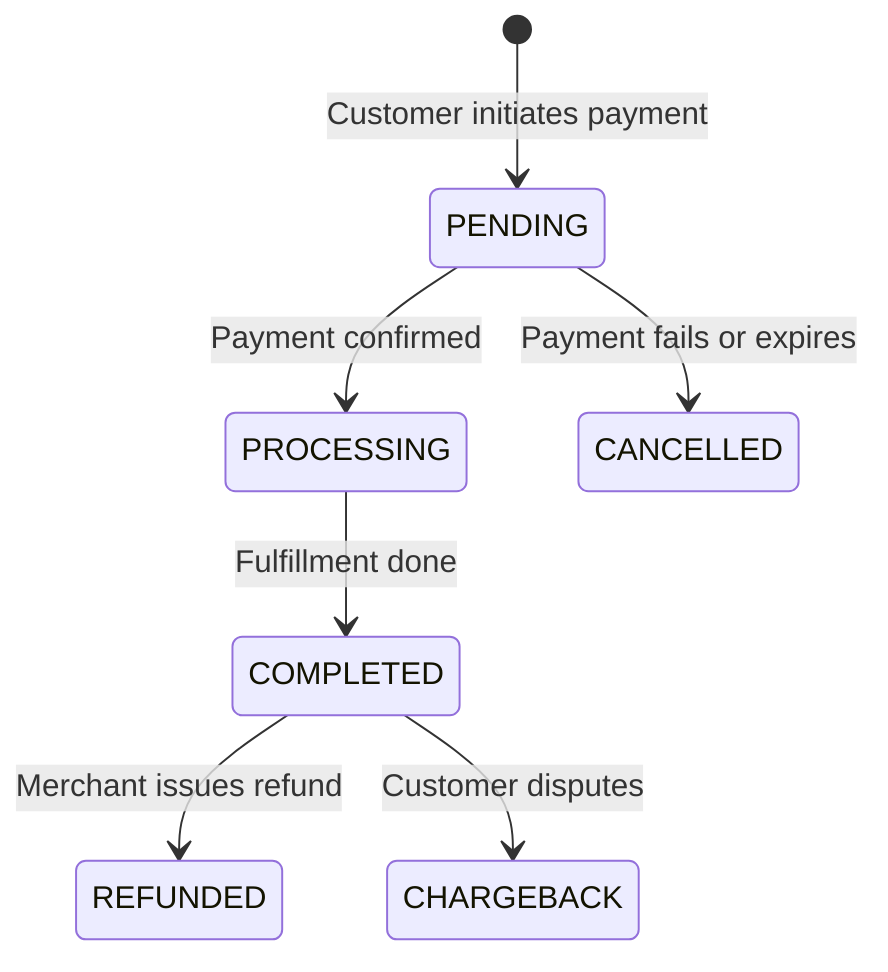

Every payment in Pandabase follows a defined lifecycle from creation to completion. Understanding this lifecycle helps you build reliable integrations and handle edge cases.

## Overview



## Order statuses

| Status | Description |
|--------|-------------|
| `PENDING` | Order created, awaiting payment |
| `PROCESSING` | Payment received, fulfillment in progress |
| `COMPLETED` | Order fulfilled successfully |
| `CANCELLED` | Payment failed, expired, or was canceled |
| `FAILED` | Payment failed |
| `REFUNDED` | Order was refunded |
| `CHARGEBACK` | A dispute was opened on this order |

## Payment statuses

| Status | Description |
|--------|-------------|
| `PENDING` | Payment intent created, awaiting customer action |
| `PROCESSING` | Payment is being processed |
| `COMPLETED` | Payment successfully collected |
| `FAILED` | Payment failed |
| `REFUNDED` | Payment was refunded |
| `DISPUTED` | Customer filed a dispute |

## Lifecycle flow

### 1. Payment initiated

When a customer proceeds to pay, an order and payment are created with `PENDING` status. A `PAYMENT_PENDING` webhook event is fired.

```json
{
  "event": "PAYMENT_PENDING",
  "id": "evt_abc123",
  "timestamp": "2026-03-07T12:00:00.000Z",
  "data": {
    "order": {
      "id": "ord_abc123",
      "orderNumber": "cs_abc123",
      "status": "PENDING",
      "amount": 2999,
      "currency": "USD",
      "customFields": null,
      "metadata": null,
      "items": [...]
    },
    "customer": { "id": "cus_abc123", "email": "customer@example.com" },
    "geo": null
  }
}
```

<Note>
  At this stage, geo data (`city`, `region`, `country`) may be `null` — it is
  enriched asynchronously after checkout. Subsequent events will include full
  geo data.
</Note>

### 2. Payment succeeds

Once the payment provider confirms the payment, the payment moves to `COMPLETED` and the order moves to `PROCESSING` (fulfillment in progress) or `COMPLETED` (already fulfilled). A `PAYMENT_COMPLETED` webhook event is fired.

<Note>
  `PAYMENT_COMPLETED` is the primary event to listen for when fulfilling orders.
  It fires when the payment is confirmed and includes the full order data
  including `customFields` and `metadata`.
</Note>

### 3. Payment fails

If the payment is declined, expires, or the customer abandons checkout, the order moves to `CANCELLED`. A `PAYMENT_FAILED` webhook event is fired. If a coupon was applied, its usage count is automatically restored.

### 4. Refund

When a merchant issues a refund, the order status changes to `REFUNDED` and the payment status changes to `REFUNDED`. A `PAYMENT_REFUNDED` webhook event is fired.

### 5. Dispute

If a customer opens a chargeback with their bank, the order moves to `CHARGEBACK` and the payment moves to `DISPUTED`. The disputed amount plus a $20.00 fee is deducted from the store's balance. A `PAYMENT_DISPUTED` webhook event is fired.

If the dispute is resolved, either `PAYMENT_DISPUTE_WON` (balance restored, order returns to `COMPLETED`) or `PAYMENT_DISPUTE_LOST` (funds stay deducted) is fired.

## Webhook events by lifecycle stage

| Stage | Event | Key data |
|-------|-------|----------|
| Payment initiated | `PAYMENT_PENDING` | `order`, `customer` |
| Payment confirmed | `PAYMENT_COMPLETED` | `order`, `customer`, `geo` |
| Payment failed | `PAYMENT_FAILED` | `order`, `customer` |
| Refund issued | `PAYMENT_REFUNDED` | `order`, `customer` |
| Dispute opened | `PAYMENT_DISPUTED` | `order`, `customer` |
| Dispute won | `PAYMENT_DISPUTE_WON` | `order`, `customer` |
| Dispute lost | `PAYMENT_DISPUTE_LOST` | `order`, `customer` |
