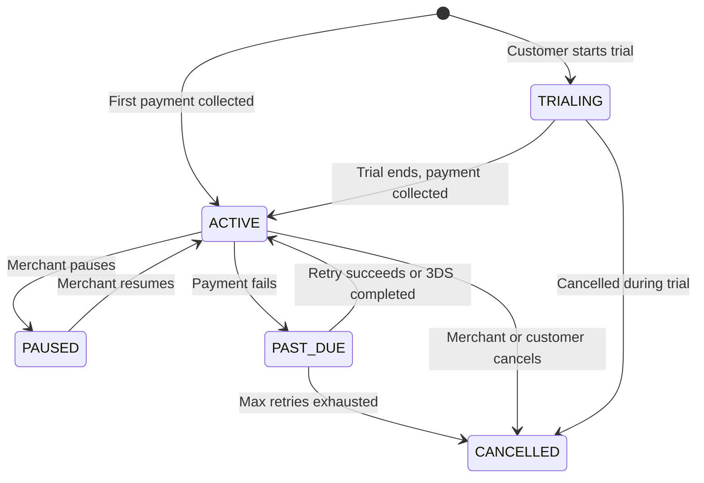

<Warning>
  Subscriptions is in beta. The API is stable but features may evolve as we
  iterate. Reach out to support@pandabase.io if you have feedback.
</Warning>

## Overview

Pandabase handles the full subscription lifecycle — billing, retries, 3D Secure authentication, invoices, and cancellation. You create a product with `type: SUBSCRIPTION`, and the platform takes care of everything else.



## How it works

1. **Create a subscription product** with a billing interval (weekly, monthly, or yearly)
2. **Customer checks out** — pays the first charge (or starts a free trial)
3. **Card is saved** — Pandabase stores the payment method securely for future charges
4. **Automatic renewals** — the platform charges the customer on each billing cycle
5. **Invoices sent** — customers receive a PDF invoice email on every charge
6. **Lifecycle events** — webhooks fire on every state change

## Creating a subscription product

Set `type` to `SUBSCRIPTION` and configure the billing interval:

```bash
curl -X POST https://api.pandabase.io/v2/stores/{storeId}/products \
  -H "Authorization: Bearer {token}" \
  -H "Content-Type: application/json" \
  -d '{
    "title": "Pro Plan",
    "price": 1999,
    "type": "SUBSCRIPTION",
    "billing_interval": "MONTHLY",
    "status": "ACTIVE",
    "fulfillment_mode": "MANUAL"
  }'
```

| Field | Options | Description |
|-------|---------|-------------|
| `billing_interval` | `WEEKLY`, `MONTHLY`, `YEARLY` | How often the customer is charged |
| `trial_days` | `0`–`365` | Free trial period before first charge (optional) |

## Checkout flow

Create a checkout session with a subscription product — the checkout UI automatically adapts:

- Shows the billing interval (e.g. "$19.99 / month")
- Shows trial info if applicable (e.g. "7-day free trial, then $19.99/month")
- Restricts payment to card and Link (required for recurring billing)
- Shows a consent checkbox before payment
- Button text changes to "Subscribe" or "Start subscription"

```bash
curl -X POST https://api.pandabase.io/v2/stores/{storeId}/checkouts \
  -H "Content-Type: application/json" \
  -d '{
    "items": [{ "product_id": "prd_xxx", "quantity": 1 }],
    "customer": {
      "name": "Jane Doe",
      "email": "jane@example.com",
      "billing": {
        "line1": "123 Main St",
        "city": "San Francisco",
        "state": "CA",
        "postal_code": "94105",
        "country": "US"
      }
    }
  }'
```

<Note>
  Subscriptions are not supported for connected stores (Stripe Connect). Only
  Merchant of Record (MoR) mode is supported.
</Note>

## Subscription statuses

| Status | Description |
|--------|-------------|
| `TRIALING` | Customer is in a free trial — no charges until trial ends |
| `ACTIVE` | Billing is active, customer is being charged on schedule |
| `PAST_DUE` | Payment failed — retrying automatically or awaiting 3DS verification |
| `PAUSED` | Billing paused by merchant — no charges until resumed |
| `CANCELLED` | Subscription ended — no further charges |

## Free trials

Set `trial_days` on the product to offer a free trial:

```json
{
  "title": "Pro Plan",
  "price": 1999,
  "type": "SUBSCRIPTION",
  "billing_interval": "MONTHLY",
  "trial_days": 7,
  "status": "ACTIVE"
}
```

During checkout, the customer saves their card without being charged. The subscription starts in `TRIALING` status and the first charge happens automatically when the trial ends.

## Failed payments and retries

When a renewal payment fails, Pandabase:

1. Moves the subscription to `PAST_DUE`
2. Fires a `SUBSCRIPTION_PAST_DUE` webhook
3. Emails the customer about the failed payment
4. Retries automatically with backoff:
   - **Retry 1**: 24 hours later
   - **Retry 2**: 48 hours later
   - **Retry 3**: 72 hours later
5. If all retries fail, the subscription is cancelled

## 3D Secure on renewals

Some banks require 3D Secure authentication for recurring charges. When this happens:

1. The subscription moves to `PAST_DUE`
2. The customer receives an email with a secure verification link
3. The customer clicks the link and completes the bank's authentication
4. The payment is processed and the subscription returns to `ACTIVE`

No action is needed from you — Pandabase handles the authentication flow automatically.

## Managing subscriptions

### Via API

```bash
# list subscriptions
GET /v2/stores/{storeId}/subscriptions

# get subscription detail
GET /v2/stores/{storeId}/subscriptions/{subscriptionId}

# cancel (at period end by default)
POST /v2/stores/{storeId}/subscriptions/{subscriptionId}/cancel
# cancel immediately
POST /v2/stores/{storeId}/subscriptions/{subscriptionId}/cancel
  -d '{ "immediate": true }'

# pause billing
POST /v2/stores/{storeId}/subscriptions/{subscriptionId}/pause

# resume billing
POST /v2/stores/{storeId}/subscriptions/{subscriptionId}/resume
```

### Via Store API (token-authenticated)

Use `SUBSCRIPTIONS_READ` and `SUBSCRIPTIONS_WRITE` permissions on your Store API token:

```bash
GET  /v2/core/stores/{storeId}/subscriptions
GET  /v2/core/stores/{storeId}/subscriptions/{subscriptionId}
POST /v2/core/stores/{storeId}/subscriptions/{subscriptionId}/cancel
```

### Via Customer Portal

Customers can view and cancel their subscriptions at [mypandabase.com](https://mypandabase.com). Cancellation is always at period end — customers retain access until the current billing period expires.

## Cancellation behavior

| Who cancels | Behavior |
|-------------|----------|
| **Merchant** (default) | Cancels at end of current billing period |
| **Merchant** (immediate) | Cancels immediately, revokes access, revokes licenses if `revoke_on_refund` is enabled |
| **Customer** | Always cancels at end of current billing period |
| **System** (max retries) | Cancels after 4 failed payment attempts |

## Webhook events

Six events are available for subscription state changes:

| Event | When |
|-------|------|
| `SUBSCRIPTION_CREATED` | First payment or trial setup succeeds |
| `SUBSCRIPTION_RENEWED` | Renewal payment succeeds |
| `SUBSCRIPTION_PAST_DUE` | Renewal failed or needs 3DS |
| `SUBSCRIPTION_CANCELLED` | Cancelled by merchant, customer, or max retries |
| `SUBSCRIPTION_PAUSED` | Merchant paused billing |
| `SUBSCRIPTION_RESUMED` | Merchant resumed billing |

See [Webhook Events](/developers/webhooks/events) for payload details and integration examples.

## Invoices

Customers automatically receive a PDF invoice via email on:
- The first subscription payment
- Every renewal payment

Invoices include the product name, amount, billing period, tax breakdown, and next charge date.

## Limitations

- Only one subscription item per checkout (no mixing with one-time items)
- Billing is in USD only (multicurrency renewals are a future enhancement)
- Price is locked at creation — changing the product price does not affect existing subscriptions
- Connected stores (Stripe Connect) are not supported
- Subscription upgrades/downgrades are not yet supported — cancel and re-subscribe
