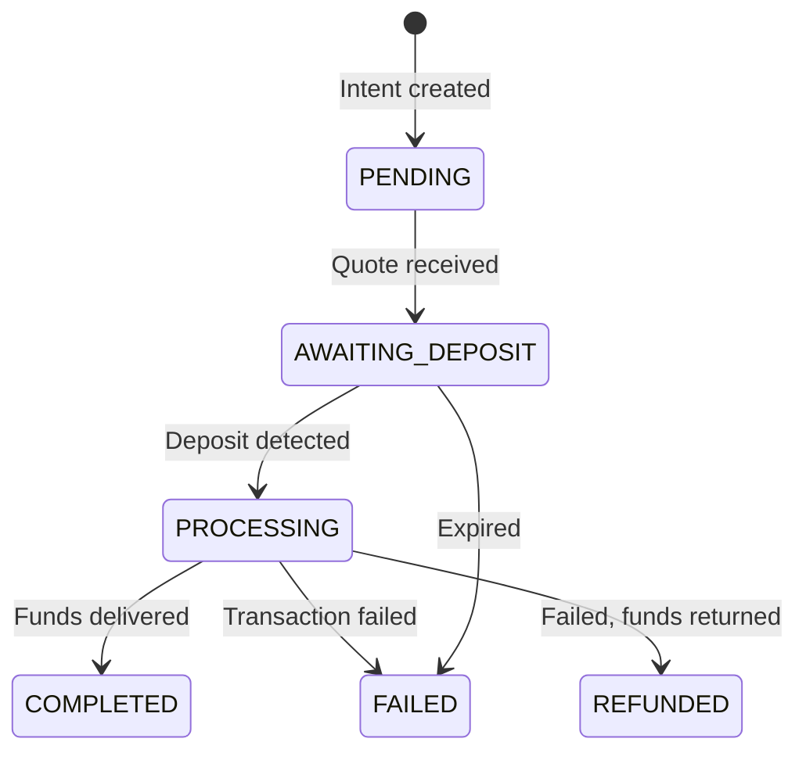

<Warning>
  This is a low-level API for advanced integrations. For most use cases, the standard [checkout flow](/developers/onchain/integration) handles everything automatically.
</Warning>

## Create payment intent

Create a new onchain payment intent to receive crypto from a customer.

```
POST https://api.pandabase.io/v2/{storeId}/onramp/payment-intents
```

### Request body

| Field                   | Type   | Required | Description                                                                 |
| ----------------------- | ------ | -------- | --------------------------------------------------------------------------- |
| `amount`                | string | Yes      | Amount in the token's smallest unit (e.g. `"1000000"` for 1 USDC)          |
| `originAsset`           | string | Yes      | Chain and token identifier (e.g. `SOL_USDC`, `ETH_USDT`, `BTC_BTC`)       |
| `customerRefundAddress` | string | Yes      | Customer's wallet address for refunds                                       |
| `refundType`            | string | Yes      | Refund destination — `ORIGIN_CHAIN` returns funds on the same chain         |
| `slippageTolerance`     | integer| No       | Slippage tolerance in basis points (e.g. `100` = 1%)                        |
| `metadata`              | object | No       | Arbitrary key-value pairs for your internal tracking (max 20 keys)          |

### Example request

```bash
curl -X POST https://api.pandabase.io/v2/{storeId}/onramp/payment-intents \
  -H "Authorization: Bearer sk_live_xxx" \
  -H "Content-Type: application/json" \
  -d '{
    "amount": "1000000",
    "originAsset": "SOL_USDC",
    "customerRefundAddress": "7xKXtg2CW87d97TXJSDpbD5jBkheTqA83TZRuJosgAsU",
    "refundType": "ORIGIN_CHAIN",
    "slippageTolerance": 100,
    "metadata": { "orderId": "order_123" }
  }'
```

### Example response

```json
{
  "paymentId": "onpi_abc123",
  "depositAddress": "3Kz9bK...deposit",
  "outputAmount": "999000",
  "expiresAt": "2026-04-08T16:30:00.000Z",
  "status": "AWAITING_DEPOSIT"
}
```

| Field            | Type   | Description                                              |
| ---------------- | ------ | -------------------------------------------------------- |
| `paymentId`      | string | Unique payment intent ID (`onpi_` prefix)                |
| `depositAddress` | string | Address the customer should send tokens to               |
| `outputAmount`   | string | Expected output amount after fees and slippage           |
| `expiresAt`      | string | ISO 8601 timestamp — payment must arrive before this time |
| `status`         | string | Initial status of the payment intent                     |

## Get payment status

Retrieve the current status of a payment intent.

```
GET https://api.pandabase.io/v2/{storeId}/onramp/payment-intents/{paymentId}
```

### Example request

```bash
curl https://api.pandabase.io/v2/{storeId}/onramp/payment-intents/onpi_abc123 \
  -H "Authorization: Bearer sk_live_xxx"
```

### Example response

```json
{
  "id": "onpi_abc123",
  "amount": "1000000",
  "originAsset": "SOL_USDC",
  "recipientAddress": "So11...",
  "status": "COMPLETED",
  "liveStatus": "SUCCESS",
  "txHash": "0xabc...",
  "metadata": { "orderId": "order_123" },
  "expiresAt": "2026-04-08T16:30:00.000Z",
  "completedAt": "2026-04-08T16:20:00.000Z",
  "createdAt": "2026-04-08T16:15:00.000Z"
}
```

| Field              | Type   | Description                                        |
| ------------------ | ------ | -------------------------------------------------- |
| `id`               | string | Payment intent ID                                  |
| `amount`           | string | Original amount requested                          |
| `originAsset`      | string | Chain and token identifier                         |
| `recipientAddress` | string | Merchant's receiving address                       |
| `status`           | string | Current payment status (see below)                 |
| `liveStatus`       | string | Underlying chain transaction status                |
| `txHash`           | string | On-chain transaction hash (available after deposit) |
| `metadata`         | object | Your metadata from the creation request            |
| `expiresAt`        | string | Expiration timestamp                               |
| `completedAt`      | string | Completion timestamp (null if not yet completed)   |
| `createdAt`        | string | Creation timestamp                                 |

## Payment statuses

| Status             | Description                                            |
| ------------------ | ------------------------------------------------------ |
| `PENDING`          | Payment created, no quote yet                          |
| `AWAITING_DEPOSIT` | Quote received, waiting for customer to send tokens    |
| `PROCESSING`       | Deposit detected, in progress                          |
| `COMPLETED`        | Funds delivered to merchant's address                  |
| `FAILED`           | Payment failed                                         |
| `REFUNDED`         | Payment failed, funds returned to customer             |



## Asset identifiers

The `originAsset` field uses the format `{CHAIN}_{TOKEN}`. Examples:

| Asset         | Chain    | Token |
| ------------- | -------- | ----- |
| `BTC_BTC`     | Bitcoin  | BTC   |
| `ETH_USDC`    | Ethereum | USDC  |
| `ETH_ETH`     | Ethereum | ETH   |
| `SOL_USDC`    | Solana   | USDC  |
| `SOL_SOL`     | Solana   | SOL   |
| `BASE_USDC`   | Base     | USDC  |
| `ARB_USDC`    | Arbitrum | USDC  |
| `AVAX_USDC`   | Avalanche| USDC  |
| `TON_TON`     | TON      | TON   |
| `TRX_USDT`    | Tron     | USDT  |
| `POL_USDC`    | Polygon  | USDC  |

See [Supported Chains](/developers/onchain/supported-chains) for the full list.
