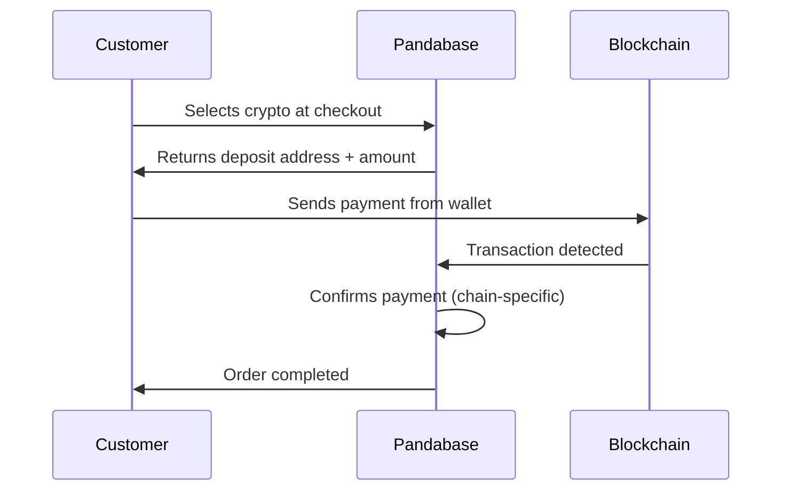

<Warning>
  Onchain Payments is in beta. The API is stable but features may evolve as we
  iterate. Reach out to support@pandabase.io if you have feedback.
</Warning>

## Overview

Onchain Payments lets you accept cryptocurrency directly from your customers across 20+ blockchains and hundreds of tokens. Pandabase generates unique deposit addresses per checkout, monitors the chain for confirmation, and settles funds to your balance automatically.

No wallet infrastructure, no node management, no manual reconciliation.

## How it works

1. **Customer selects crypto** — at checkout, the customer picks a chain and token
2. **Deposit address generated** — Pandabase returns a unique address and the exact token amount based on real-time exchange rates
3. **Customer sends payment** — from any wallet (MetaMask, Phantom, Ledger, exchange, etc.)
4. **Transaction confirmed** — Pandabase monitors the chain and confirms after the required number of block confirmations
5. **Order completed** — the payment is marked as complete, webhooks fire, and your balance is updated

## Key features

- **20+ supported chains** — major L1s, L2s, and alt-L1s
- **Hundreds of tokens** — stablecoins, native tokens, and popular ERC-20/SPL tokens
- **Real-time exchange rates** — token amounts are calculated at checkout time with a locked rate window
- **Automatic confirmation** — block confirmations are chain-specific and handled by Pandabase
- **Underpayment and overpayment handling** — configurable tolerance thresholds
- **Same webhook events** — `PAYMENT_COMPLETED`, `PAYMENT_FAILED`, and all existing events work with onchain payments
- **No custody** — payments are swept to Pandabase's settlement wallets and converted to your payout currency automatically

## Settlement

Onchain payments are settled to your available balance in USD (or your store's base currency) after conversion. The exchange rate is locked at the time the customer initiates the payment.

| Step             | Description                                               |
| ---------------- | --------------------------------------------------------- |
| Payment detected | Transaction appears on-chain                              |
| Confirmation     | Required block confirmations reached (varies by chain)    |
| Conversion       | Crypto converted to your base currency at the locked rate |
| Balance updated  | Funds added to your available balance                     |

<Note>
  Onchain payments follow the same payout process as card payments. Once settled
  to your balance, you can request a payout to your bank account as usual.
</Note>

## Fees

Onchain payments use **1.5% + $0.30** platform fee. Network fees (gas) are paid by the customer as part of their on-chain transaction — they are not deducted from your balance.

## Next steps

<CardGroup cols={2}>
  <Card
    title="Supported Chains"
    icon="link"
    href="/developers/onchain/supported-chains"
  >
    See all supported blockchains and tokens.
  </Card>
  <Card
    title="Integration Guide"
    icon="code"
    href="/developers/onchain/integration"
  >
    Start accepting crypto payments in your store.
  </Card>
</CardGroup>
