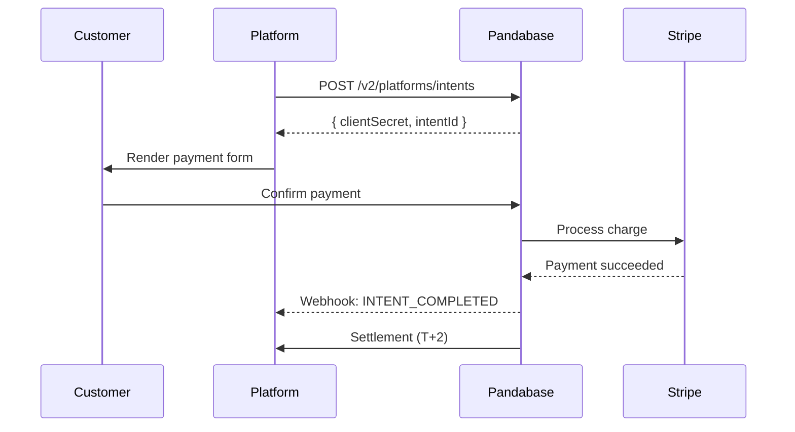

<Warning>
  Platform Intents is in **private beta** and requires approval. Contact
  [platforms@pandabase.io](mailto:platforms@pandabase.io) to request access.
  Unauthorized use of platform endpoints will result in immediate key revocation.
</Warning>

## Overview

Platform Intents allow SaaS platforms, marketplaces, and commerce tools to embed Pandabase as their payment backbone. Your platform registers as a **Platform Partner**, receives a `platform_id` and scoped credentials, and creates payment intents on behalf of your merchants — all while Pandabase handles MoR obligations, tax remittance, disputes, and compliance.



## Prerequisites

Before integrating, your platform must complete the following:

1. **Platform application** — Submit your platform details, expected volume, and merchant onboarding flow for review
2. **Compliance review** — Our compliance team reviews your platform's KYC/AML procedures and merchant vetting process
3. **Technical review** — Architecture review to ensure your integration meets our security and data handling requirements
4. **Sandbox access** — Upon approval, you receive sandbox credentials for integration testing
5. **Production certification** — Complete the certification checklist before going live

<Note>
  The review process typically takes 5–10 business days. Platforms processing
  over $100K/month in GMV may be eligible for expedited review.
</Note>

## Authentication

Platform requests use a separate authentication scheme from the Store API.

### Platform API Key

Your platform receives two credential sets:

| Credential | Format | Purpose |
|-----------|--------|---------|
| Platform ID | `plt_` prefix | Identifies your platform in all requests |
| Platform Secret | `psk_` prefix | Signs requests via HMAC-SHA512 |
| Merchant Provisioning Key | `mpk_` prefix | Creates and manages merchant sub-accounts |

All platform requests require **dual authentication** — both the platform signature and the merchant context:

```
Authorization: Platform plt_your_platform_id
X-Platform-Signature: HMAC-SHA512(psk_secret, canonical_request)
X-Merchant-Context: shp_merchant_store_id
X-Request-Timestamp: 1679000000000
X-Idempotency-Key: unique_request_id
```

### Canonical Request Signing

Platform signatures use a stricter signing process than standard HMAC tokens:

```typescript
import crypto from "crypto";

function signPlatformRequest(
  method: string,
  path: string,
  body: string,
  timestamp: number,
  secret: string,
): string {
  const canonicalRequest = [
    method.toUpperCase(),
    path,
    timestamp.toString(),
    crypto.createHash("sha256").update(body || "").digest("hex"),
  ].join("\n");

  return crypto
    .createHmac("sha512", secret)
    .update(canonicalRequest)
    .digest("hex");
}
```

<Warning>
  Platform signatures use **SHA-512** (not SHA-256). Requests with SHA-256
  signatures will be rejected. The signing key is your raw `psk_` secret — do
  not hash it first.
</Warning>

## Merchant Provisioning

Before creating intents, you must provision merchants on your platform.

### Create a merchant sub-account

```bash
POST /v2/platforms/merchants
Authorization: Platform plt_xxx
X-Platform-Signature: {signature}

{
  "externalId": "your_internal_merchant_id",
  "businessName": "Merchant Corp",
  "email": "merchant@example.com",
  "country": "US",
  "category": "DIGITAL_PRODUCTS",
  "onboardingTier": "STANDARD",
  "capabilities": {
    "payments": true,
    "subscriptions": false,
    "payouts": false
  },
  "riskProfile": {
    "expectedMonthlyVolume": "FROM_1K_TO_10K",
    "averageTransactionSize": 2500,
    "businessModel": "B2C"
  }
}
```

Response:
```json
{
  "ok": true,
  "data": {
    "merchantId": "shp_provisioned_xxx",
    "platformId": "plt_xxx",
    "externalId": "your_internal_merchant_id",
    "status": "PENDING_REVIEW",
    "capabilities": {
      "payments": "PENDING",
      "subscriptions": "DISABLED",
      "payouts": "DISABLED"
    },
    "limits": {
      "maxTransactionAmount": 50000,
      "dailyVolumeCap": 500000,
      "monthlyVolumeCap": 5000000
    }
  }
}
```

<Note>
  Merchants provisioned via platforms undergo the same compliance review as
  direct signups. Capability activation is not instant — `PENDING` capabilities
  are reviewed within 24 hours.
</Note>

### Merchant capability statuses

| Status | Description |
|--------|-------------|
| `PENDING` | Under review by compliance team |
| `ACTIVE` | Capability is live and usable |
| `RESTRICTED` | Temporarily limited due to risk signals |
| `SUSPENDED` | Suspended pending investigation |
| `DISABLED` | Not enabled for this merchant |

## Creating Platform Intents

A Platform Intent represents a payment you want to collect on behalf of a merchant.

```bash
POST /v2/platforms/intents
Authorization: Platform plt_xxx
X-Platform-Signature: {signature}
X-Merchant-Context: shp_provisioned_xxx
X-Idempotency-Key: intent_abc123

{
  "amount": 4999,
  "currency": "USD",
  "description": "Pro Plan — Monthly",
  "customer": {
    "email": "buyer@example.com",
    "name": "Jane Doe"
  },
  "lineItems": [
    {
      "name": "Pro Plan",
      "amount": 4999,
      "quantity": 1
    }
  ],
  "platformFee": 500,
  "metadata": {
    "platformOrderId": "order_12345",
    "planId": "pro_monthly"
  },
  "returnUrl": "https://yourplatform.com/payments/success",
  "cancelUrl": "https://yourplatform.com/payments/cancelled",
  "expiresIn": 3600
}
```

Response:
```json
{
  "ok": true,
  "data": {
    "intentId": "pti_cm5x7k2a000001j0g8h3f9d2e",
    "clientSecret": "pti_cm5x7k2a000001j0g8h3f9d2e_secret_xxx",
    "status": "REQUIRES_PAYMENT",
    "amount": 4999,
    "currency": "USD",
    "feeBreakdown": {
      "pandabaseFee": 315,
      "platformFee": 500,
      "merchantReceives": 4184
    },
    "paymentUrl": "https://pay.pandabase.io/intents/pti_xxx",
    "expiresAt": "2026-03-20T13:00:00.000Z"
  }
}
```

### Fee structure

| Component | Calculation | Description |
|-----------|------------|-------------|
| Pandabase MoR fee | 5.9% + 20¢ | Platform rate (standard) |
| PSP processing | 2.9% + 30¢ | Included in MoR fee |
| Platform fee | Set by you | Your revenue per transaction |
| Merchant receives | Amount − MoR fee − platform fee | Net settlement to merchant |

<Warning>
  Platform fees cannot exceed 30% of the transaction amount. Platforms
  consistently setting fees above 15% may be flagged for review.
</Warning>

### Intent statuses

| Status | Description |
|--------|-------------|
| `REQUIRES_PAYMENT` | Awaiting customer payment |
| `PROCESSING` | Payment is being processed |
| `COMPLETED` | Payment succeeded, settlement pending |
| `FAILED` | Payment failed |
| `EXPIRED` | Intent expired before payment |
| `CANCELLED` | Cancelled by platform |
| `REFUNDED` | Payment was refunded |
| `DISPUTED` | Customer opened a dispute |

## Frontend Integration

### Using Pandabase.js

```html
<script src="https://js.pandabase.io/v2/platform.js"></script>
```

```javascript
const pandabase = Pandabase.init("plt_xxx", { mode: "production" });

const { intentId, clientSecret } = await createIntentOnYourBackend();

const payment = pandabase.createPaymentElement({
  clientSecret,
  appearance: {
    theme: "auto",
    variables: {
      colorPrimary: "#0071e3",
      borderRadius: "8px",
    },
  },
});

payment.mount("#payment-container");

payment.on("complete", (result) => {
  if (result.status === "COMPLETED") {
    window.location.href = "/success";
  }
});

payment.on("error", (error) => {
  showError(error.message);
});
```

### Using hosted payment page

For simpler integrations, redirect customers to the hosted payment URL:

```javascript
const { paymentUrl } = await createIntentOnYourBackend();
window.location.href = paymentUrl;
```

## Webhooks

Platform webhooks are delivered to your registered platform endpoint with enhanced security:

```json
{
  "event": "INTENT_COMPLETED",
  "platformId": "plt_xxx",
  "merchantId": "shp_provisioned_xxx",
  "intentId": "pti_cm5x7k2a000001j0g8h3f9d2e",
  "timestamp": "2026-03-20T12:05:00.000Z",
  "data": {
    "amount": 4999,
    "currency": "USD",
    "platformFee": 500,
    "merchantReceives": 4184,
    "customer": {
      "email": "buyer@example.com"
    },
    "metadata": {
      "platformOrderId": "order_12345"
    }
  },
  "signature": {
    "algorithm": "HMAC-SHA512",
    "timestamp": 1679000000000
  }
}
```

### Platform webhook events

| Event | Description |
|-------|-------------|
| `INTENT_CREATED` | Intent created, awaiting payment |
| `INTENT_COMPLETED` | Payment collected |
| `INTENT_FAILED` | Payment failed |
| `INTENT_EXPIRED` | Intent expired |
| `INTENT_REFUNDED` | Payment refunded |
| `INTENT_DISPUTED` | Dispute opened |
| `MERCHANT_ACTIVATED` | Merchant capabilities activated |
| `MERCHANT_SUSPENDED` | Merchant suspended |
| `SETTLEMENT_INITIATED` | Payout to merchant initiated |
| `SETTLEMENT_COMPLETED` | Payout to merchant completed |

## Settlement

Platform settlements follow a T+2 schedule:

- **Day 0**: Payment collected
- **Day 1**: Compliance hold and fraud screening
- **Day 2**: Funds settled to merchant's designated account

Platform fees are settled to your platform's payout account on a weekly basis (every Monday).

### Settlement API

```bash
GET /v2/platforms/settlements
Authorization: Platform plt_xxx
X-Platform-Signature: {signature}

# Query parameters:
# status: PENDING, PROCESSING, COMPLETED, FAILED
# merchantId: Filter by merchant
# from: Start date (ISO 8601)
# to: End date (ISO 8601)
```

## Rate Limits

Platform endpoints have separate rate limits from the standard API:

| Endpoint | Limit |
|----------|-------|
| Create intent | 100/s per platform |
| Merchant provisioning | 10/min per platform |
| Settlement queries | 30/s per platform |
| Webhook management | 10/min per platform |

## Compliance Requirements

Platforms must maintain:

- **Merchant vetting**: KYC/KYB procedures for all merchants onboarded through your platform
- **Transaction monitoring**: Real-time monitoring for suspicious patterns
- **Dispute management**: Response SLA of 48 hours for dispute evidence
- **Data retention**: 7-year retention of transaction records
- **PCI compliance**: SAQ-A minimum for platforms using hosted payment page, SAQ-A-EP for custom payment forms
- **Annual review**: Platforms undergo annual compliance review

<Warning>
  Failure to maintain compliance requirements may result in platform suspension.
  Pandabase reserves the right to hold settlements during compliance
  investigations.
</Warning>

## Sandbox Testing

Sandbox credentials are provided upon platform approval. The sandbox environment mirrors production with the following differences:

- No real charges are processed
- Settlement is simulated (instant)
- Merchant provisioning is auto-approved
- Rate limits are relaxed (10x production limits)

```
Sandbox API: https://api.sandbox.pandabase.io/v2/platforms
Sandbox JS:  https://js.sandbox.pandabase.io/v2/platform.js
```

## Getting Started

1. Email [platforms@pandabase.io](mailto:platforms@pandabase.io) with:
   - Your platform name and URL
   - Expected monthly GMV
   - Number of merchants
   - Integration timeline
   - Technical contact
2. Complete the platform application form (sent after initial review)
3. Schedule a technical review call
4. Receive sandbox credentials
5. Build and test your integration
6. Complete the production certification checklist
7. Go live

<Note>
  Platform Intents is designed for platforms processing $10K+/month in GMV.
  For smaller integrations, consider using the standard
  [Store API](/developers/learn/api-tokens) with a single store.
</Note>
