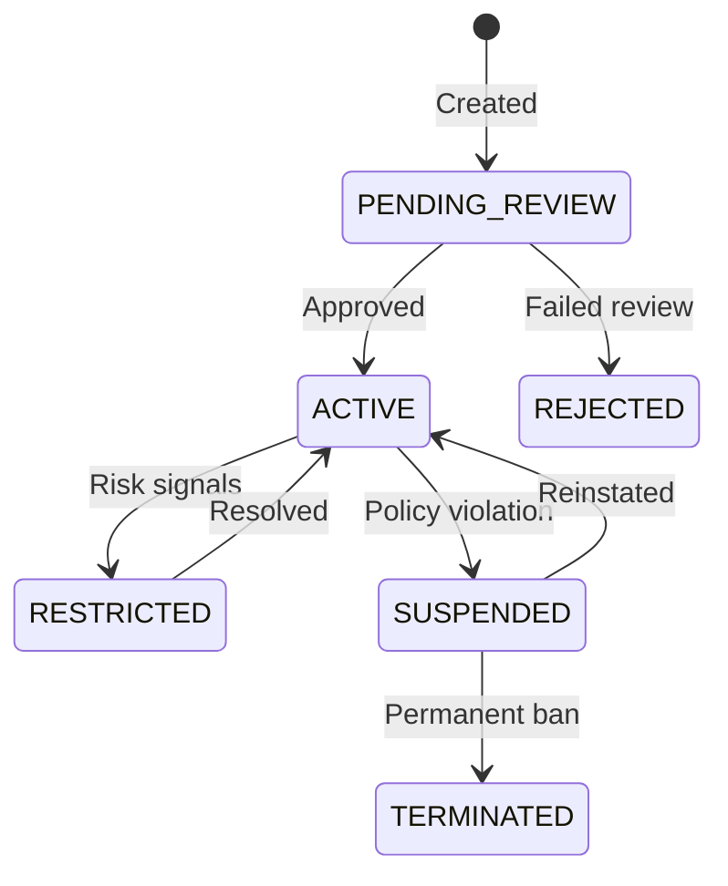

<Warning>
  Platform Merchants is in **private beta**. Requires an approved Platform
  Partner account.
</Warning>

## Overview

When a new merchant joins your platform, you provision them as a sub-account through the Merchant Provisioning API. Pandabase creates a store on their behalf, runs compliance checks, and activates payment capabilities.

## Creating a merchant

```bash
POST /v2/platforms/merchants
Authorization: Platform plt_xxx
X-Platform-Signature: {signature}

{
  "externalId": "your_internal_merchant_id",
  "businessName": "Coffee Shop Co",
  "email": "owner@coffeeshop.co",
  "country": "US",
  "category": "DIGITAL_PRODUCTS",
  "onboardingTier": "STANDARD",
  "capabilities": {
    "payments": true,
    "subscriptions": false,
    "payouts": true
  },
  "riskProfile": {
    "expectedMonthlyVolume": "FROM_1K_TO_10K",
    "averageTransactionSize": 1500,
    "businessModel": "B2C"
  },
  "metadata": {
    "planId": "pro",
    "signupSource": "website"
  }
}
```

### Onboarding tiers

| Tier | Review time | Volume cap | Requirements |
|------|------------|------------|-------------|
| `EXPRESS` | Instant | $5,000/month | Email verification only |
| `STANDARD` | < 24 hours | $50,000/month | Basic KYB review |
| `ENHANCED` | 2–5 days | $500,000/month | Full KYB + document verification |
| `ENTERPRISE` | Custom | Unlimited | Dedicated compliance review |

<Note>
  `EXPRESS` tier merchants are limited to $5,000/month and $500/transaction
  until they upgrade to `STANDARD` or higher.
</Note>

## Merchant lifecycle



## Capabilities

Each merchant has granular capabilities that you control:

| Capability | Description | Requires |
|-----------|-------------|----------|
| `payments` | Accept one-time payments | STANDARD tier+ |
| `subscriptions` | Accept recurring payments | STANDARD tier+ |
| `payouts` | Receive bank payouts | ENHANCED tier+ |
| `disputes` | Self-manage dispute evidence | STANDARD tier+ |

### Requesting capabilities

```bash
POST /v2/platforms/merchants/{merchantId}/capabilities
Authorization: Platform plt_xxx
X-Platform-Signature: {signature}

{
  "capabilities": ["subscriptions", "payouts"]
}
```

New capabilities go through review before activation. You'll receive a `MERCHANT_CAPABILITY_UPDATED` webhook when the status changes.

## Listing merchants

```bash
GET /v2/platforms/merchants?status=ACTIVE&page=1&limit=25
Authorization: Platform plt_xxx
X-Platform-Signature: {signature}
```

### Query parameters

| Parameter | Type | Description |
|----------|------|-------------|
| `status` | string | Filter by status: `PENDING_REVIEW`, `ACTIVE`, `RESTRICTED`, `SUSPENDED`, `TERMINATED` |
| `search` | string | Search by business name or email |
| `country` | string | Filter by country code |
| `page` | integer | Page number (default: 1) |
| `limit` | integer | Items per page (default: 25, max: 100) |

## Updating a merchant

```bash
PATCH /v2/platforms/merchants/{merchantId}
Authorization: Platform plt_xxx
X-Platform-Signature: {signature}

{
  "businessName": "Coffee Shop Co (Updated)",
  "metadata": {
    "planId": "enterprise"
  }
}
```

<Warning>
  Changing a merchant's `country` or `category` triggers a re-review. The
  merchant's capabilities may be temporarily restricted during this process.
</Warning>

## Suspending a merchant

```bash
POST /v2/platforms/merchants/{merchantId}/suspend
Authorization: Platform plt_xxx
X-Platform-Signature: {signature}

{
  "reason": "Terms of service violation",
  "holdSettlements": true
}
```

Suspended merchants cannot process new payments. Pending settlements can optionally be held.

## Merchant webhooks

| Event | Description |
|-------|-------------|
| `MERCHANT_CREATED` | Merchant provisioned |
| `MERCHANT_ACTIVATED` | Compliance review passed |
| `MERCHANT_REJECTED` | Compliance review failed |
| `MERCHANT_RESTRICTED` | Capabilities restricted |
| `MERCHANT_SUSPENDED` | Merchant suspended |
| `MERCHANT_CAPABILITY_UPDATED` | Capability status changed |
