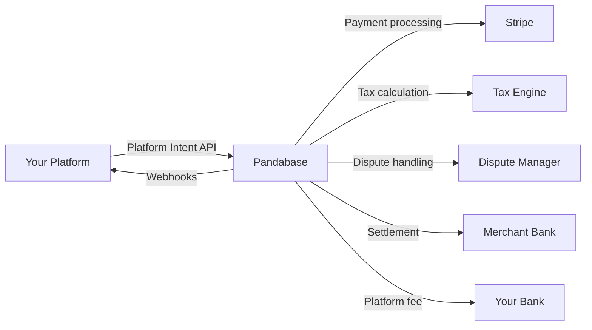

<Warning>
  The Platforms program is in **private beta**. Access requires approval from our
  partnerships team. Email [platforms@pandabase.io](mailto:platforms@pandabase.io)
  to apply.
</Warning>

## What are Platform Intents?

Platform Intents let SaaS platforms, marketplaces, and commerce tools use Pandabase as their payment infrastructure. Instead of each merchant signing up individually, your platform manages their payment lifecycle through a single integration.

**You handle the product experience. We handle payments, tax, disputes, and compliance.**

## How it works

1. Your platform registers as a **Platform Partner** and receives scoped credentials
2. You provision merchants (sub-accounts) via API as they onboard to your platform
3. When a customer buys something, you create a **Platform Intent** specifying the amount, merchant, and your platform fee
4. Pandabase processes the payment as Merchant of Record
5. You receive webhooks for every lifecycle event
6. Funds settle to your merchants on a T+2 schedule, with your platform fee sent to you weekly

## Why use Platforms?

| Without Platforms | With Platforms |
|-------------------|----------------|
| Each merchant signs up for Pandabase separately | You onboard merchants via API in seconds |
| Merchants manage their own dashboard | You control the full experience |
| No platform-level reporting | Unified analytics across all merchants |
| No fee splitting | Automatic platform fee on every transaction |
| Merchants handle disputes | Pandabase handles disputes as MoR |

## Platform credentials

| Credential | Prefix | Purpose |
|-----------|--------|---------|
| Platform ID | `plt_` | Identifies your platform |
| Platform Secret | `psk_` | Signs API requests (HMAC-SHA512) |
| Merchant Provisioning Key | `mpk_` | Creates merchant sub-accounts |

## Architecture

## Guides

<CardGroup cols={2}>
  <Card title="Platform Intents" icon="credit-card" href="/developers/platforms/intents">
    Create and manage payment intents on behalf of merchants
  </Card>
  <Card title="Merchant Provisioning" icon="users" href="/developers/platforms/merchants">
    Onboard and manage merchant sub-accounts
  </Card>
  <Card title="Settlements" icon="building-columns" href="/developers/platforms/settlements">
    Understand settlement timing and platform fee payouts
  </Card>
  <Card title="Compliance" icon="shield-check" href="/developers/platforms/compliance">
    Requirements for maintaining platform partner status
  </Card>
</CardGroup>

## Requirements

To qualify for the Platforms program:

- **Minimum GMV**: $10,000/month expected payment volume
- **Merchant count**: At least 5 merchants on your platform
- **Legal entity**: Registered business in a [supported country](/developers/introduction)
- **Technical capacity**: Engineering team capable of API integration
- **Compliance**: Existing KYC/AML procedures for merchant onboarding

## Getting started

1. Apply at [platforms@pandabase.io](mailto:platforms@pandabase.io)
2. Complete the platform application and compliance questionnaire
3. Technical architecture review with our integrations team
4. Receive sandbox credentials
5. Build, test, and certify your integration
6. Go live
