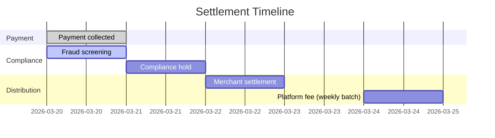

<Warning>
  Platform Settlements is in **private beta**. Requires an approved Platform
  Partner account.
</Warning>

## Overview

When a Platform Intent is completed, funds flow through a structured settlement pipeline. Pandabase handles the full settlement lifecycle — collecting from the customer, holding funds during the compliance window, and distributing to the merchant and your platform.

## Settlement timeline



| Day | Event | Description |
|-----|-------|-------------|
| T+0 | Payment collected | Customer pays via Platform Intent |
| T+0 | Fraud screening | Automated fraud and risk analysis |
| T+1 | Compliance hold | 24-hour hold for dispute/chargeback window |
| T+2 | Merchant settlement | Funds released to merchant's bank account |
| Weekly | Platform fee payout | Your accumulated platform fees paid out every Monday |

<Note>
  Settlement timing may be extended for merchants in `RESTRICTED` status or
  during compliance investigations. High-risk transactions may be held for up
  to 7 days.
</Note>

## Fee distribution

For a $50.00 transaction with a $5.00 platform fee:

| Component | Amount | Recipient |
|-----------|--------|-----------|
| Customer pays | $50.00 | — |
| Pandabase MoR fee (5.9% + 20¢) | $3.15 | Pandabase |
| PSP processing (included) | — | — |
| Platform fee | $5.00 | Your platform |
| Merchant receives | $41.85 | Merchant |

## Querying settlements

### List merchant settlements

```bash
GET /v2/platforms/settlements?merchantId=shp_xxx&status=COMPLETED&from=2026-03-01&to=2026-03-31
Authorization: Platform plt_xxx
X-Platform-Signature: {signature}
```

Response:
```json
{
  "ok": true,
  "data": {
    "items": [
      {
        "id": "stl_xxx",
        "intentId": "pti_xxx",
        "merchantId": "shp_xxx",
        "amount": 4185,
        "platformFee": 500,
        "status": "COMPLETED",
        "settledAt": "2026-03-22T08:00:00.000Z",
        "reference": "po_xxx"
      }
    ],
    "pagination": {
      "page": 1,
      "limit": 25,
      "total": 142,
      "totalPages": 6
    },
    "summary": {
      "totalSettled": 595000,
      "totalPlatformFees": 71000,
      "totalTransactions": 142
    }
  }
}
```

### Settlement statuses

| Status | Description |
|--------|-------------|
| `PENDING` | Payment collected, in compliance hold |
| `PROCESSING` | Settlement initiated to merchant's bank |
| `COMPLETED` | Funds delivered to merchant |
| `HELD` | Settlement held for investigation |
| `FAILED` | Settlement failed (bank rejection, etc.) |

## Platform fee payouts

Your platform fees accumulate and are paid out every Monday to your registered bank account.

```bash
GET /v2/platforms/payouts
Authorization: Platform plt_xxx
X-Platform-Signature: {signature}
```

Response:
```json
{
  "ok": true,
  "data": {
    "items": [
      {
        "id": "ppay_xxx",
        "amount": 15400,
        "transactionCount": 87,
        "periodStart": "2026-03-11T00:00:00.000Z",
        "periodEnd": "2026-03-17T23:59:59.000Z",
        "status": "COMPLETED",
        "paidAt": "2026-03-18T08:00:00.000Z"
      }
    ]
  }
}
```

### Minimum payout

Platform fee payouts require a minimum balance of **$25.00**. If your accumulated fees are below this threshold, they roll over to the next payout cycle.

## Refunds and disputes

When a refund or dispute occurs on a Platform Intent:

- **Refund**: The full amount is deducted from the merchant's balance. Your platform fee is **not** refunded by default. Contact support to configure platform fee refund behavior.
- **Dispute**: The disputed amount + $20.00 fee is deducted from the merchant's balance. If the merchant's balance is insufficient, the deficit is deducted from your next platform fee payout.

<Warning>
  Platforms with a dispute rate exceeding 1% across all merchants may be placed
  under review. Monitor your merchants' dispute rates via the dashboard or
  settlement API.
</Warning>

## Settlement webhooks

| Event | Description |
|-------|-------------|
| `SETTLEMENT_INITIATED` | Payout to merchant started |
| `SETTLEMENT_COMPLETED` | Payout to merchant delivered |
| `SETTLEMENT_FAILED` | Payout failed |
| `SETTLEMENT_HELD` | Payout held for investigation |
| `PLATFORM_PAYOUT_COMPLETED` | Your weekly platform fee paid |
