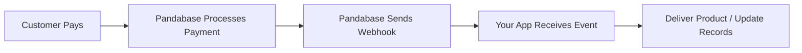
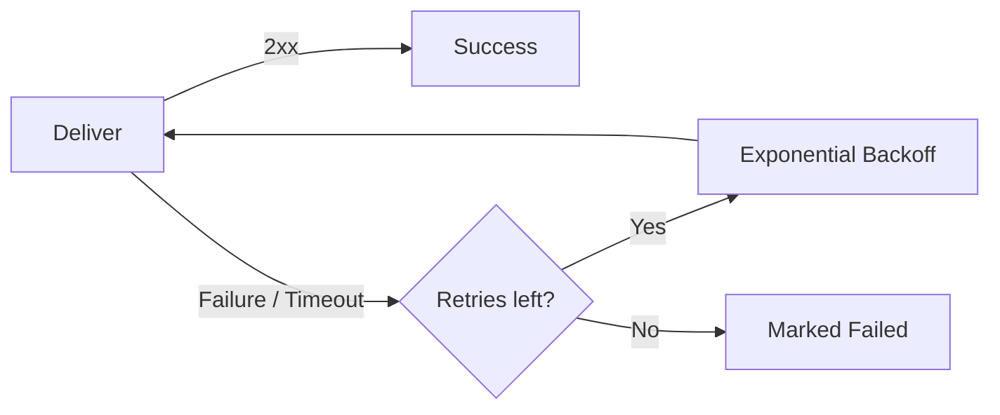

## Why use webhooks?

Webhooks let you react to events in real time. When something happens in your store — a payment is collected, a refund is issued, a dispute is opened — Pandabase sends a `POST` request to your endpoint with the event data. This is how you deliver license keys, update your database, send notifications, or trigger any custom logic immediately after a purchase.



## Event overview

See the full [event reference](/developers/webhooks/events) for detailed descriptions and payload examples.

## Payload structure

Every webhook delivery is a JSON `POST` request. The payload includes the event type, a unique event ID, a timestamp, and a `data` object containing the order, customer, and geo information.

```json
{
  "event": "PAYMENT_COMPLETED",
  "id": "evt_cm5x7k2a000001j0g8h3f9d2e",
  "timestamp": "2026-03-07T12:00:00.000Z",
  "data": {
    "order": {
      "id": "ord_cm5x7k2a000001j0g8h3f9d2e",
      "orderNumber": "cs_cm5x7k2a000001j0g8h3f9d2e",
      "status": "COMPLETED",
      "amount": 2999,
      "currency": "USD",
      "customFields": { "discord": "johndoe#1234" },
      "metadata": { "campaign": "spring_sale", "ref": "partner_abc" },
      "items": [
        {
          "productId": "prd_cm5x7k2a000001j0g8h3f9d2e",
          "variantId": null,
          "name": "Pro Plan",
          "quantity": 1,
          "amount": 2999
        }
      ]
    },
    "customer": {
      "id": "cus_cm5x7k2a000001j0g8h3f9d2e",
      "email": "buyer@example.com"
    },
    "geo": {
      "ip": "1.2.3.4",
      "country": "US",
      "city": "Miami",
      "region": "FL"
    }
  }
}
```

All monetary values are in **cents** (integers). No floats.

## Headers

Every webhook delivery includes headers for verification and deduplication:

| Header              | Description                                                                                              |
| ------------------- | -------------------------------------------------------------------------------------------------------- |
| `Webhook-Signature` | HMAC-SHA256 hex digest of `${Webhook-Timestamp}.${rawBody}`, signed with your webhook secret             |
| `Webhook-Timestamp` | Unix timestamp (milliseconds) of when the delivery was sent — used to enforce a 5-minute freshness window |
| `Webhook-Id`        | Unique delivery ID — store this to deduplicate retried deliveries                                        |
| `Content-Type`      | `application/json`                                                                                       |
| `User-Agent`        | `Pandabase (https://pandabase.io)`                                                                       |

<Note>
  Legacy `X-Pandabase-Signature`, `X-Pandabase-Timestamp`, and `X-Pandabase-Idempotency` headers are still sent for backwards compatibility but will be removed in the future (minimum 60 days notice). See [Migrate webhook signatures](/developers/webhooks/migrate-signatures).
</Note>

## Retries

Failed deliveries are retried up to **5 times** with exponential backoff (1s → 2s → 4s → 8s → 16s). A `2xx` response is treated as success. Anything else — a non-2xx status, a timeout (15 seconds), or a connection error — triggers a retry.



## Verification

Always verify `Webhook-Signature` before processing a delivery. The signature is a hex HMAC-SHA256 of `${Webhook-Timestamp}.${rawBody}`, signed with your webhook secret. You must also reject deliveries whose `Webhook-Timestamp` is older than 5 minutes — that's what closes the replay window.

<Warning>
  Hash the **raw request body**, not a re-serialized JSON object. Use constant-time comparison (`timingSafeEqual`, `hmac.compare_digest`). Never compare signatures with `===` or `==`.
</Warning>

<CodeGroup>

```typescript Node.js
import crypto from "node:crypto";

const TOLERANCE_MS = 5 * 60 * 1000;

function verifyWebhook(
  headers: Record<string, string>,
  rawBody: string,
  secret: string,
): boolean {
  const timestamp = headers["webhook-timestamp"];
  const signature = headers["webhook-signature"];
  if (!timestamp || !signature) return false;

  const signedPayload = `${timestamp}.${rawBody}`;
  const expected = crypto
    .createHmac("sha256", secret)
    .update(signedPayload)
    .digest("hex");

  if (expected.length !== signature.length) return false;
  if (!crypto.timingSafeEqual(Buffer.from(expected), Buffer.from(signature))) {
    return false;
  }

  const skewMs = Math.abs(Date.now() - Number(timestamp));
  return skewMs <= TOLERANCE_MS;
}

// Express example
app.post(
  "/webhooks/pandabase",
  express.raw({ type: "application/json" }),
  (req, res) => {
    if (
      !verifyWebhook(
        req.headers as Record<string, string>,
        req.body.toString(),
        WEBHOOK_SECRET,
      )
    ) {
      return res.status(401).send("Invalid signature");
    }

    const event = JSON.parse(req.body.toString());

    switch (event.event) {
      case "PAYMENT_COMPLETED":
        console.log(`Payment completed for order ${event.data.order.id}`);
        break;
      case "PAYMENT_REFUNDED":
        console.log(`Refund issued for order ${event.data.order.id}`);
        break;
    }

    res.status(200).send("OK");
  },
);
```

```python Python
import hmac, hashlib, time
from flask import Flask, request, jsonify

app = Flask(__name__)
WEBHOOK_SECRET = "whk_your_secret_here"
TOLERANCE_MS = 5 * 60 * 1000

def verify(headers, raw_body: bytes) -> bool:
    timestamp = headers.get("Webhook-Timestamp")
    signature = headers.get("Webhook-Signature")
    if not timestamp or not signature:
        return False

    signed_payload = f"{timestamp}.{raw_body.decode()}".encode()
    expected = hmac.new(WEBHOOK_SECRET.encode(), signed_payload, hashlib.sha256).hexdigest()

    if not hmac.compare_digest(expected, signature):
        return False

    skew_ms = abs(int(time.time() * 1000) - int(timestamp))
    return skew_ms <= TOLERANCE_MS

@app.route("/webhooks/pandabase", methods=["POST"])
def handle_webhook():
    if not verify(request.headers, request.data):
        return jsonify(error="Invalid signature"), 401

    event = request.json

    if event["event"] == "PAYMENT_COMPLETED":
        print(f"Payment completed for order {event['data']['order']['id']}")
    elif event["event"] == "PAYMENT_REFUNDED":
        print(f"Refund issued for order {event['data']['order']['id']}")

    return jsonify(message="OK"), 200
```

```go Go
package main

import (
    "crypto/hmac"
    "crypto/sha256"
    "encoding/hex"
    "encoding/json"
    "io"
    "log"
    "net/http"
    "strconv"
    "time"
)

var webhookSecret = []byte("whk_your_secret_here")

const toleranceMs = 5 * 60 * 1000

func verify(headers http.Header, body []byte) bool {
    ts := headers.Get("Webhook-Timestamp")
    sig := headers.Get("Webhook-Signature")
    if ts == "" || sig == "" {
        return false
    }

    mac := hmac.New(sha256.New, webhookSecret)
    mac.Write([]byte(ts + "." + string(body)))
    expected := hex.EncodeToString(mac.Sum(nil))

    if !hmac.Equal([]byte(expected), []byte(sig)) {
        return false
    }

    tsInt, err := strconv.ParseInt(ts, 10, 64)
    if err != nil {
        return false
    }
    skew := time.Now().UnixMilli() - tsInt
    if skew < 0 {
        skew = -skew
    }
    return skew <= toleranceMs
}

func webhookHandler(w http.ResponseWriter, r *http.Request) {
    body, _ := io.ReadAll(r.Body)

    if !verify(r.Header, body) {
        http.Error(w, "Invalid signature", http.StatusUnauthorized)
        return
    }

    var event struct {
        Event string `json:"event"`
        Data  struct {
            Order struct {
                ID string `json:"id"`
            } `json:"order"`
        } `json:"data"`
    }
    json.Unmarshal(body, &event)

    switch event.Event {
    case "PAYMENT_COMPLETED":
        log.Printf("Payment completed for order %s", event.Data.Order.ID)
    case "PAYMENT_REFUNDED":
        log.Printf("Refund issued for order %s", event.Data.Order.ID)
    }

    w.WriteHeader(http.StatusOK)
}

func main() {
    http.HandleFunc("/webhooks/pandabase", webhookHandler)
    http.ListenAndServe(":3000", nil)
}
```

</CodeGroup>

<Note>
  Already verifying against the legacy `X-Pandabase-Signature`? Your endpoint keeps working until the legacy headers are removed. See [Migrate webhook signatures](/developers/webhooks/migrate-signatures) to switch over.
</Note>

## Best practices

1. **Return 200 immediately.** Do heavy processing asynchronously.
2. **Verify every request.** Always check `Webhook-Signature` and reject stale `Webhook-Timestamp` values before acting on a webhook.
3. **Deduplicate with idempotency keys.** Store `Webhook-Id` values and skip already-processed events.
4. **Filter events.** Only subscribe to the events you need to reduce noise.
5. **Handle out-of-order delivery.** Events may occasionally arrive out of sequence. Use the order `status` field rather than assuming event order.
