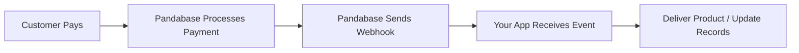
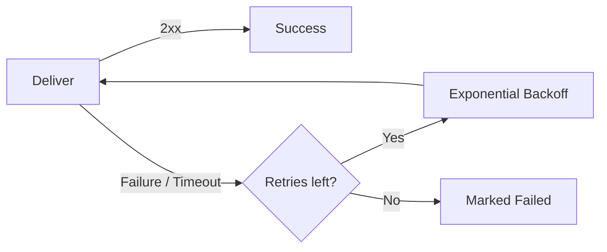

## Why use webhooks?

Webhooks let you react to events in real time. When something happens in your store — a payment is collected, a refund is issued, a dispute is opened — Pandabase sends a `POST` request to your endpoint with the event data. This is how you deliver license keys, update your database, send notifications, or trigger any custom logic immediately after a purchase.



## Event overview

Pandabase fires webhook events when payment-related state changes occur. Each event type maps to a specific moment in the payment lifecycle:

| Event                  | When it fires                          |
| ---------------------- | -------------------------------------- |
| `PAYMENT_PENDING`      | Customer initiates payment at checkout |
| `PAYMENT_COMPLETED`    | Payment is successfully collected      |
| `PAYMENT_FAILED`       | Payment fails, is canceled, or expires |
| `PAYMENT_REFUNDED`     | A charge is refunded                   |
| `PAYMENT_DISPUTED`     | Customer opens a chargeback dispute    |
| `PAYMENT_DISPUTE_WON`  | Dispute resolved in your favor         |
| `PAYMENT_DISPUTE_LOST` | Dispute resolved against you           |

See the full [event reference](/developers/webhooks/events) for detailed descriptions and payload examples.

## Payload structure

Every webhook delivery is a JSON `POST` request. The payload includes the event type, a unique event ID, a timestamp, and a `data` object containing the order, customer, and geo information.

```json
{
  "event": "PAYMENT_COMPLETED",
  "id": "evt_cm5x7k2a000001j0g8h3f9d2e",
  "timestamp": "2026-03-07T12:00:00.000Z",
  "data": {
    "order": {
      "id": "ord_cm5x7k2a000001j0g8h3f9d2e",
      "orderNumber": "cs_cm5x7k2a000001j0g8h3f9d2e",
      "status": "COMPLETED",
      "amount": 2999,
      "currency": "USD",
      "customFields": { "discord": "johndoe#1234" },
      "items": [
        {
          "productId": "prd_cm5x7k2a000001j0g8h3f9d2e",
          "variantId": null,
          "name": "Pro Plan",
          "quantity": 1,
          "amount": 2999
        }
      ]
    },
    "customer": {
      "id": "cus_cm5x7k2a000001j0g8h3f9d2e",
      "email": "buyer@example.com"
    },
    "geo": {
      "ip": "1.2.3.4",
      "country": "US",
      "city": "Miami",
      "region": "FL"
    }
  }
}
```

All monetary values are in **cents** (integers). No floats.

## Headers

Every webhook delivery includes headers for verification and deduplication:

| Header                    | Description                                                                  |
| ------------------------- | ---------------------------------------------------------------------------- |
| `X-Pandabase-Signature`   | HMAC-SHA256 hex digest of the raw JSON body, signed with your webhook secret |
| `X-Pandabase-Timestamp`   | Unix timestamp (milliseconds) of when the delivery was sent                  |
| `X-Pandabase-Idempotency` | Unique delivery ID — store this to deduplicate retried deliveries            |
| `Content-Type`            | `application/json`                                                           |
| `User-Agent`              | `Pandabase (https://pandabase.io)`                                           |

## Retries

Failed deliveries are retried up to **5 times** with exponential backoff (1s → 2s → 4s → 8s → 16s). A `2xx` response is treated as success. Anything else — a non-2xx status, a timeout (15 seconds), or a connection error — triggers a retry.



## Verification

Always verify the `X-Pandabase-Signature` header before processing a webhook. This confirms the request came from Pandabase and hasn't been tampered with.

The signature is an HMAC-SHA256 hex digest of the **raw request body** using your webhook secret as the key.

<Warning>
  Use constant-time comparison (`timingSafeEqual`, `hmac.compare_digest`) to
  prevent timing attacks. Never compare signatures with `===` or `==`.
</Warning>

<CodeGroup>

```typescript Node.js
import crypto from "crypto";

function verifyWebhook(
  rawBody: string,
  signature: string,
  secret: string,
): boolean {
  const expected = crypto
    .createHmac("sha256", secret)
    .update(rawBody)
    .digest("hex");

  return crypto.timingSafeEqual(Buffer.from(expected), Buffer.from(signature));
}

// Express example
app.post(
  "/webhooks/pandabase",
  express.raw({ type: "application/json" }),
  (req, res) => {
    const signature = req.headers["x-pandabase-signature"] as string;

    if (
      !signature ||
      !verifyWebhook(req.body.toString(), signature, WEBHOOK_SECRET)
    ) {
      return res.status(401).send("Invalid signature");
    }

    const event = JSON.parse(req.body.toString());

    switch (event.event) {
      case "PAYMENT_COMPLETED":
        // Fulfill the order
        console.log(`Payment completed for order ${event.data.order.id}`);
        break;
      case "PAYMENT_REFUNDED":
        // Revoke access
        console.log(`Refund issued for order ${event.data.order.id}`);
        break;
    }

    res.status(200).send("OK");
  },
);
```

```python Python
import hmac
import hashlib
import json
from flask import Flask, request, jsonify

app = Flask(__name__)
WEBHOOK_SECRET = "whk_your_secret_here"

@app.route("/webhooks/pandabase", methods=["POST"])
def handle_webhook():
    signature = request.headers.get("X-Pandabase-Signature", "")
    expected = hmac.new(
        WEBHOOK_SECRET.encode(),
        request.data,
        hashlib.sha256,
    ).hexdigest()

    if not hmac.compare_digest(expected, signature):
        return jsonify(error="Invalid signature"), 401

    event = request.json

    if event["event"] == "PAYMENT_COMPLETED":
        order = event["data"]["order"]
        print(f"Payment completed for order {order['id']}")
    elif event["event"] == "PAYMENT_REFUNDED":
        order = event["data"]["order"]
        print(f"Refund issued for order {order['id']}")

    return jsonify(message="OK"), 200
```

```go Go
package main

import (
    "crypto/hmac"
    "crypto/sha256"
    "encoding/hex"
    "encoding/json"
    "io"
    "log"
    "net/http"
)

var webhookSecret = []byte("whk_your_secret_here")

func verifySignature(body []byte, signature string) bool {
    mac := hmac.New(sha256.New, webhookSecret)
    mac.Write(body)
    expected := hex.EncodeToString(mac.Sum(nil))
    return hmac.Equal([]byte(expected), []byte(signature))
}

func webhookHandler(w http.ResponseWriter, r *http.Request) {
    body, _ := io.ReadAll(r.Body)
    signature := r.Header.Get("X-Pandabase-Signature")

    if !verifySignature(body, signature) {
        http.Error(w, "Invalid signature", http.StatusUnauthorized)
        return
    }

    var event struct {
        Event string `json:"event"`
        Data  struct {
            Order struct {
                ID string `json:"id"`
            } `json:"order"`
        } `json:"data"`
    }
    json.Unmarshal(body, &event)

    switch event.Event {
    case "PAYMENT_COMPLETED":
        log.Printf("Payment completed for order %s", event.Data.Order.ID)
    case "PAYMENT_REFUNDED":
        log.Printf("Refund issued for order %s", event.Data.Order.ID)
    }

    w.WriteHeader(http.StatusOK)
}

func main() {
    http.HandleFunc("/webhooks/pandabase", webhookHandler)
    http.ListenAndServe(":3000", nil)
}
```

</CodeGroup>

## Best practices

1. **Return 200 immediately.** Do heavy processing asynchronously. Pandabase times out after 15 seconds.
2. **Verify every request.** Always check `X-Pandabase-Signature` before acting on a webhook.
3. **Deduplicate with idempotency keys.** Store `X-Pandabase-Idempotency` values and skip already-processed events.
4. **Use HTTPS.** Webhook URLs must use `https://`. Pandabase rejects insecure endpoints.
5. **Filter events.** Only subscribe to the events you need to reduce noise.
6. **Handle out-of-order delivery.** Events may occasionally arrive out of sequence. Use the order `status` field rather than assuming event order.
