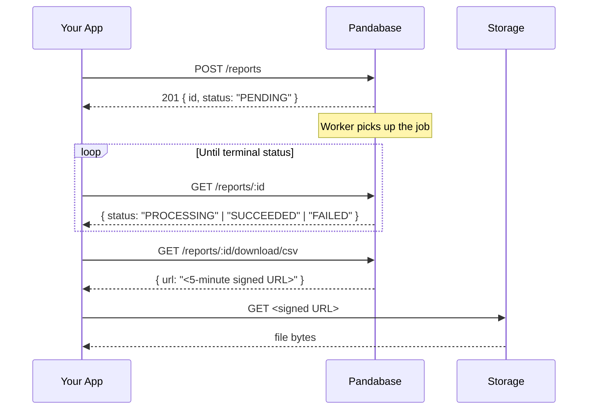

<Callout type="warn">

We will assume you have a general understanding of programming. This guide is
intended for developers, and we expect you to have a good understanding of
REST APIs in general. If you're not a developer, please skip this section.

</Callout>

## Overview

The Reports API generates large financial exports asynchronously. You queue a report, poll for completion, then download a CSV or JSON file from a short-lived pre-signed URL.

Use this when you need to:

- Pull financial activity into an external system (a data warehouse, an accounting tool, an audit pipeline)
- Reconcile payouts against the underlying transactions
- Run periodic exports on a cron job for ETL

For one-off exports from the dashboard, see the [merchant guide](/store/finances/reports).



## Report types

| Type                    | What it contains                                                                                                                                      |
| ----------------------- | ----------------------------------------------------------------------------------------------------------------------------------------------------- |
| `PAYMENT_ACTIVITY`      | Every payment we processed in the period. Order, status, intended and discount and fee and total and settled amounts, presentment currency and rate, customer details. |
| `PAYOUT_RECONCILIATION` | Every payout request. Amount, fees, status, PSP reference, risk score, destination bank account.                                                                        |
| `BALANCE_LEDGER`        | Every credit and debit on your store: payments in, refunds out, disputes, payouts. Includes the running balance and the tamper-evident hash chain.                      |
| `REFUNDS_DISPUTES`      | Refunds and chargebacks combined. One row per event with a `kind` column tagging the section.                                                         |

## Authentication

Reports endpoints sit on both the dashboard API (session JWT) and the Store API (API tokens). For programmatic access, use a [store API token](/developers/learn/api-tokens) with the right scopes:

| Endpoint                                                                | Required scope  |
| ----------------------------------------------------------------------- | --------------- |
| `POST /reports`                                                         | `REPORTS_WRITE` |
| `GET /reports`, `GET /reports/:id`, `GET /reports/:id/download/:format` | `REPORTS_READ`  |

Mint a token in the dashboard under **Settings → Developers → API Tokens**, granting only the scopes you need.

## Step 1: Queue a report

```bash
curl -X POST https://api.pandabase.io/v2/core/stores/{storeId}/reports \
  -H "Authorization: Bearer sk_live_..." \
  -H "Content-Type: application/json" \
  -d '{
    "type": "PAYMENT_ACTIVITY",
    "periodStart": "2026-04-01T00:00:00Z",
    "periodEnd":   "2026-05-01T00:00:00Z",
    "formats": ["CSV", "JSON"]
  }'
```

Response:

```json
{
  "ok": true,
  "data": {
    "id": "rpt_8h4t6sqzy3x9w5n2k1m0vqbf",
    "type": "PAYMENT_ACTIVITY",
    "status": "PENDING",
    "formats": ["CSV", "JSON"],
    "periodStart": "2026-04-01T00:00:00.000Z",
    "periodEnd": "2026-05-01T00:00:00.000Z",
    "rowCount": null,
    "sizeBytes": null,
    "durationMs": null,
    "errorMessage": null,
    "requestedByAccountId": null,
    "requestedByTokenId": "stk_xxx",
    "startedAt": null,
    "completedAt": null,
    "createdAt": "2026-05-22T10:00:00.000Z",
    "updatedAt": "2026-05-22T10:00:00.000Z"
  }
}
```

### Parameters

| Field         | Required | Description                                                                               |
| ------------- | -------- | ----------------------------------------------------------------------------------------- |
| `type`        | yes      | One of `PAYMENT_ACTIVITY`, `PAYOUT_RECONCILIATION`, `BALANCE_LEDGER`, `REFUNDS_DISPUTES`. |
| `periodStart` | yes      | ISO 8601 datetime. Inclusive lower bound. Interpreted as a UTC instant.                   |
| `periodEnd`   | yes      | ISO 8601 datetime. Exclusive upper bound. Must be strictly after `periodStart`.           |
| `formats`     | no       | Array of `CSV` and/or `JSON`. Defaults to `["CSV"]`. At least one, at most two.           |

### Errors

| Status | Cause                                                                        |
| ------ | ---------------------------------------------------------------------------- |
| `400`  | Invalid datetimes, `periodEnd` not after `periodStart`, or period > 90 days. |
| `403`  | Token is missing `REPORTS_WRITE`.                                            |
| `404`  | Store doesn't exist or token can't access it.                                |
| `429`  | Store has 10 or more reports already in `PENDING`/`PROCESSING`.              |

## Step 2: Poll for completion

```bash
curl https://api.pandabase.io/v2/core/stores/{storeId}/reports/{reportId} \
  -H "Authorization: Bearer sk_live_..."
```

The `status` field transitions:

```
PENDING ──► PROCESSING ──► SUCCEEDED  (download available)
                       └─► FAILED     (errorMessage populated)
```

Poll on a reasonable interval. Every 3 to 5 seconds is typical. Stop polling once the status is `SUCCEEDED` or `FAILED`.

Once successful, the row carries:

```json
{
  "status": "SUCCEEDED",
  "rowCount": 1247,
  "sizeBytes": 412980,
  "durationMs": 8412,
  "startedAt": "2026-05-22T10:00:00.100Z",
  "completedAt": "2026-05-22T10:00:08.512Z"
}
```

## Step 3: Download the file

```bash
curl https://api.pandabase.io/v2/core/stores/{storeId}/reports/{reportId}/download/csv \
  -H "Authorization: Bearer sk_live_..."
```

Response:

```json
{
  "ok": true,
  "data": {
    "url": "https://s3.pandabase.io/.../rpt_xxx.csv?X-Amz-Algorithm=..."
  }
}
```

Then GET the signed URL to retrieve the file bytes. The URL is valid for **5 minutes**, so don't cache it. Re-fetch the download endpoint whenever you need a fresh URL.

For `format`, use `csv` or `json` (lowercase). If the report wasn't generated with that format, you'll get `404`. If the report hasn't finished yet, you'll get `409`.

## Complete example (TypeScript)

```typescript
const STORE_ID = process.env.PANDABASE_STORE_ID!;
const API_TOKEN = process.env.PANDABASE_API_TOKEN!;

const BASE_URL = `https://api.pandabase.io/v2/core/stores/${STORE_ID}`;
const HEADERS = {
  Authorization: `Bearer ${API_TOKEN}`,
  "Content-Type": "application/json",
};

async function exportPaymentActivity(periodStart: string, periodEnd: string) {
  // 1. Queue
  const createRes = await fetch(`${BASE_URL}/reports`, {
    method: "POST",
    headers: HEADERS,
    body: JSON.stringify({
      type: "PAYMENT_ACTIVITY",
      periodStart,
      periodEnd,
      formats: ["CSV"],
    }),
  });

  const { data: report } = await createRes.json();
  console.log("Queued", report.id);

  // 2. Poll
  let status = report.status;
  while (status !== "SUCCEEDED" && status !== "FAILED") {
    await new Promise((r) => setTimeout(r, 3000));
    const pollRes = await fetch(`${BASE_URL}/reports/${report.id}`, {
      headers: HEADERS,
    });
    const { data } = await pollRes.json();
    status = data.status;
    console.log("Status:", status);

    if (status === "FAILED") {
      throw new Error(`Report failed: ${data.errorMessage}`);
    }
  }

  // 3. Get download URL + fetch the file
  const urlRes = await fetch(`${BASE_URL}/reports/${report.id}/download/csv`, {
    headers: HEADERS,
  });
  const {
    data: { url },
  } = await urlRes.json();

  const fileRes = await fetch(url);
  const csv = await fileRes.text();

  return csv;
}

const csv = await exportPaymentActivity(
  "2026-04-01T00:00:00Z",
  "2026-05-01T00:00:00Z",
);
console.log(`Got ${csv.split("\n").length - 1} rows`);
```

## CSV format

- **Encoding:** UTF-8, with a byte-order mark for Excel compatibility.
- **Header:** the first row.
- **Newlines:** `\n`.
- **Escaping:** values containing commas, quotes, or newlines are wrapped in double quotes, with embedded quotes doubled (`"` → `""`).
- **Amounts:** stored in the smallest currency unit (cents for two-decimal currencies, whole units for zero-decimal currencies like JPY and KRW). The accompanying `currency` column tells you which.
- **Timestamps:** ISO 8601 in UTC, with the `Z` suffix.
- **Nulls:** empty cells.

## Limits

| Limit                                                   | Value                               |
| ------------------------------------------------------- | ----------------------------------- |
| Maximum period span                                     | 90 days                             |
| Concurrent reports per store (`PENDING` + `PROCESSING`) | 10                                  |
| File retention                                          | 30 days from creation               |
| Download URL TTL                                        | 5 minutes                           |
| Worker retries on failure                               | 3 attempts with exponential backoff |

Reports older than 30 days are deleted automatically, both the DB row and the underlying file. A `GET` for an expired report ID returns `404`. Re-run the report if you need it again.

## Rate limits

Reports endpoints inherit the standard Store API limit: **60 requests per second per token**. Polling at 3-second intervals across many parallel reports stays well under this. If you're polling more than 50 reports at once, switch to listing with a status filter:

```bash
curl "https://api.pandabase.io/v2/core/stores/{storeId}/reports?status=PROCESSING&limit=100" \
  -H "Authorization: Bearer sk_live_..."
```

## Webhooks

Report completion does not currently fire a webhook. The store owner gets an email when the report finishes (success or failure). If you need a programmatic signal, poll `GET /reports/:id` as shown above.

## Common patterns

### Monthly cron job

Run a cron job at the start of each month that exports the previous month's payment activity:

```typescript
import { CronJob } from "cron";

new CronJob("0 0 1 * *", async () => {
  const now = new Date();
  const periodEnd = new Date(
    now.getFullYear(),
    now.getMonth(),
    1,
  ).toISOString();
  const periodStart = new Date(
    now.getFullYear(),
    now.getMonth() - 1,
    1,
  ).toISOString();

  const csv = await exportPaymentActivity(periodStart, periodEnd);
  // Upload to your data warehouse, S3, accountant's mailbox, etc.
}).start();
```

### Year-long export

Periods are capped at 90 days. To export a full year, queue four reports back-to-back.

```typescript
const QUARTERS = [
  { start: "2025-01-01T00:00:00Z", end: "2025-04-01T00:00:00Z" },
  { start: "2025-04-01T00:00:00Z", end: "2025-07-01T00:00:00Z" },
  { start: "2025-07-01T00:00:00Z", end: "2025-10-01T00:00:00Z" },
  { start: "2025-10-01T00:00:00Z", end: "2026-01-01T00:00:00Z" },
];

const csvs = await Promise.all(
  QUARTERS.map((q) => exportPaymentActivity(q.start, q.end)),
);
```
