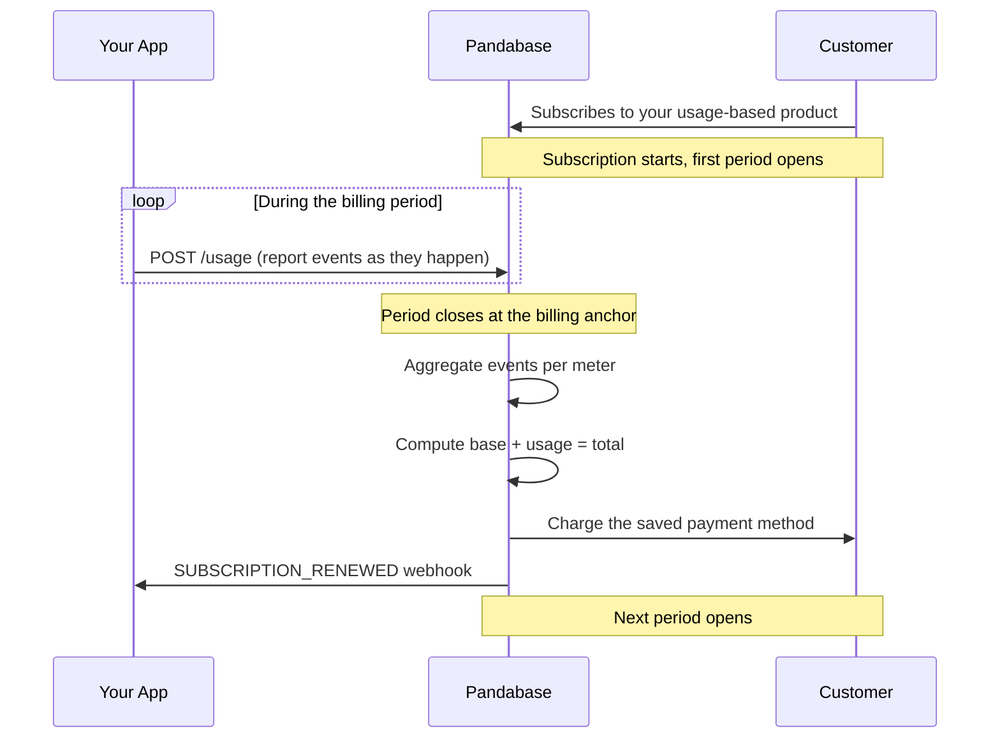

<Callout type="warn">

We will assume you have a general understanding of programming. This guide is
intended for developers, and we expect you to have a good understanding of
REST APIs in general. If you're not a developer, please skip this section.

</Callout>

## Overview

Usage-based billing lets you charge a subscription customer based on how much of your product they use during a billing period. You define one or more **meters** on a subscription product, report **usage events** as they happen, and Pandabase aggregates the totals and bills the customer at each renewal.

This is the right model for APIs (priced per request or per token), seats (priced per active user), storage (priced per gigabyte stored), or anything else where the bill cannot be known in advance.



## How it works

1. **Create a subscription product** with `pricingModel` set to `USAGE_BASED`.
2. **Add one or more meters** to the product. Each meter defines an event name, a rate, an aggregation rule, and a settlement mode.
3. **Customer subscribes** through the usual checkout flow. The saved card stays on file for renewals.
4. **Report usage events** to Pandabase as they happen from your application code. Each event is tagged with the meter's `event_name`.
5. **At renewal**, Pandabase aggregates events per meter, prices each one, adds the base subscription amount where applicable, and charges the customer. An invoice email goes out with the full breakdown.

## Step 1: Create a usage-based product

Set `pricingModel` to `USAGE_BASED` on a subscription product. The product still needs a `billingInterval` (the period over which usage accumulates) and a `price` (the base fee charged at each renewal).

```bash
curl -X POST https://api.pandabase.io/v2/core/stores/{storeId}/products \
  -H "Authorization: Bearer {token}" \
  -H "Content-Type: application/json" \
  -d '{
    "title": "AI Inference API",
    "price": 1000,
    "type": "SUBSCRIPTION",
    "billingInterval": "MONTHLY",
    "pricingModel": "USAGE_BASED",
    "status": "ACTIVE",
    "fulfillmentMode": "MANUAL"
  }'
```

<Callout type="info">

The platform enforces a **$1.00 minimum** on every checkout total. The first charge for a usage-based subscription happens at signup and contains the base `price` only (no usage has been reported yet), so `price` must be at least `100` cents. Pure pay-as-you-go (`price: 0`) is not supported at signup. Pick a small base fee or set the base to cover an included allowance with `BASE_PLUS_OVERAGE` meters.

</Callout>

| Field | Required | Description |
|-------|----------|-------------|
| `pricingModel` | yes | Must be `"USAGE_BASED"`. |
| `type` | yes | Must be `"SUBSCRIPTION"`. Usage-based one-time products are not supported. |
| `billingInterval` | yes | `WEEKLY`, `MONTHLY`, or `YEARLY`. Defines the aggregation window. |
| `price` | yes | Base fee charged at each renewal, in cents. Must be at least `100` so the initial checkout clears the $1.00 minimum. |

## Step 2: Configure meters

A meter declares one thing your product charges for: tokens, requests, gigabytes, active users, and so on. A product can have up to **10 meters**.

```bash
curl -X POST https://api.pandabase.io/v2/core/stores/{storeId}/products/{productId}/meters \
  -H "Authorization: Bearer {token}" \
  -H "Content-Type: application/json" \
  -d '{
    "eventName": "input_tokens",
    "unitPrice": 300,
    "unitQuantity": 1000000,
    "aggregation": "SUM",
    "settlement": "ARREARS"
  }'
```

This meter charges **$3.00 per 1,000,000 input tokens** consumed in a period. The math is `floor(billable_quantity * unitPrice / unitQuantity)`, all in cents, so fractional-cent pricing works without floats.

| Field | Description |
|-------|-------------|
| `eventName` | The name you'll report events under. Matches `^[a-zA-Z0-9_.-]+$`, unique per product. |
| `unitPrice` | Price in cents per `unitQuantity` units. |
| `unitQuantity` | The denominator for `unitPrice`. Use `1` for "per event", `1000000` for "per million tokens", etc. Defaults to `1`. |
| `aggregation` | How events are combined over the billing period. See [Aggregation rules](#aggregation-rules). |
| `settlement` | `ARREARS` or `BASE_PLUS_OVERAGE`. See [Settlement modes](#settlement-modes). |
| `includedUnits` | Only valid (and required) for `BASE_PLUS_OVERAGE`. Units already included in the base fee. |

### Read, update, and delete meters

```bash
# List every meter on a product
curl https://api.pandabase.io/v2/core/stores/{storeId}/products/{productId}/meters \
  -H "Authorization: Bearer {token}"

# Retrieve a single meter
curl https://api.pandabase.io/v2/core/stores/{storeId}/products/{productId}/meters/{meterId} \
  -H "Authorization: Bearer {token}"

# Update rate fields (eventName / aggregation / settlement become immutable
# once any event has been reported against the meter)
curl -X PATCH https://api.pandabase.io/v2/core/stores/{storeId}/products/{productId}/meters/{meterId} \
  -H "Authorization: Bearer {token}" \
  -H "Content-Type: application/json" \
  -d '{ "unitPrice": 250 }'

# Delete a meter (refused with 409 if any event or billed period references it)
curl -X DELETE https://api.pandabase.io/v2/core/stores/{storeId}/products/{productId}/meters/{meterId} \
  -H "Authorization: Bearer {token}"
```

`GET` and `LIST` require `METERS_READ`. `POST`, `PATCH`, and `DELETE` require `METERS_WRITE`.

## Step 3: Customer subscribes

Customers subscribe through the standard hosted checkout. There is no API difference between a flat-rate subscription and a usage-based one from the customer's perspective. The card is saved, the subscription starts in `ACTIVE` (or `TRIALING` if the product has trial days), and the first usage period opens.

```bash
curl -X POST https://api.pandabase.io/v2/stores/{storeId}/checkouts \
  -H "Content-Type: application/json" \
  -d '{
    "items": [{ "product_id": "prd_xxx", "quantity": 1 }],
    "customer": {
      "name": "Jane Doe",
      "email": "jane@example.com",
      "billing": {
        "line1": "123 Main St",
        "city": "San Francisco",
        "state": "CA",
        "postal_code": "94105",
        "country": "US"
      }
    }
  }'
```

After the customer completes the checkout, your `SUBSCRIPTION_CREATED` webhook fires and the returned subscription ID becomes the target for usage reporting.

## Step 4: Report usage events

Each time your app does the billable thing, post a usage event. The Store API accepts up to **100 events per call** for a single subscription.

<Callout type="info">

The usage endpoints use `snake_case` field names. The rest of the Store API uses `camelCase`. This is intentional: events typically come from analytics pipelines and logs that already emit snake-case keys.

</Callout>

<Callout type="info">

Events are accepted for subscriptions in `ACTIVE`, `TRIALING`, and `PAST_DUE` status. Events reported during a trial accrue into the open period and are rolled into the first non-trial charge. Events reported during `PAST_DUE` continue to accumulate; once the failed renewal succeeds on retry, the customer is billed for the full accumulated total.

</Callout>

```bash
curl -X POST https://api.pandabase.io/v2/core/stores/{storeId}/usage \
  -H "Authorization: Bearer {token}" \
  -H "Content-Type: application/json" \
  -d '{
    "subscription_id": "sub_xxx",
    "events": [
      {
        "event_name": "input_tokens",
        "quantity": 1500,
        "event_at": "2026-05-21T14:23:00Z",
        "external_id": "req-abc-123",
        "metadata": { "endpoint": "/v1/chat", "model": "claude-opus-4-7" }
      }
    ]
  }'
```

The response tells you which events were accepted, which were silently deduplicated, and which were rejected.

```json
{
  "ok": true,
  "data": {
    "subscriptionId": "sub_xxx",
    "accepted": 1,
    "duplicates": 0,
    "rejected": []
  }
}
```

The top-level call returns `201` even if some events were rejected. Always check `rejected[]` and surface per-event problems back to your reporter.

### Rejection reasons

Each entry in `rejected[]` has the form `{ "index": <int>, "reason": <string> }`. The `index` matches the position in your submitted `events` array. Possible reasons:

| Reason | Cause | Fix |
|--------|-------|-----|
| `no meter on this product matches event_name '<name>'` | The `event_name` does not match any meter on the subscription's product. | Check spelling and that the meter exists on the right product. |
| `subscription is not in a state that accepts usage events` | Subscription is `PAUSED`, `CANCELLED`, or otherwise terminal. | Stop reporting; the subscription is no longer billable. |
| `event_at is not a valid ISO timestamp` | `event_at` was provided but not parseable. | Use a full ISO-8601 string, e.g. `"2026-05-21T14:23:00Z"`. |
| `event_at is before the current period start` | The timestamp falls in an already-closed billing period. | Drop the event or report it under the next subscription's first period if applicable. |
| `event_at is too far in the future` | More than one hour ahead of server time. | Check clock skew on the reporting host. |
| `metadata exceeds 20 keys` (and similar key-length / value-length variants) | Metadata exceeded the size caps. | Trim metadata to 20 keys, 40 chars per key, 500 chars per value. |

### Event fields

| Field | Required | Description |
|-------|----------|-------------|
| `event_name` | yes | Must match a meter on the subscription's product. |
| `quantity` | yes | Non-negative integer. For `aggregation: COUNT` this is usually `1` per event. |
| `event_at` | no | ISO-8601 timestamp. Defaults to the current server time. Must fall in `[current_period_start, now + 1h]`. |
| `external_id` | no | Your idempotency key. Duplicates on `(meter_id, external_id)` are silently skipped. |
| `metadata` | no | Up to 20 string keys, 40 chars per key, 500 chars per value. Stored for audit, not used in billing. |

### TypeScript example

```typescript
const STORE_ID = process.env.PANDABASE_STORE_ID!;
const API_TOKEN = process.env.PANDABASE_API_TOKEN!;

async function reportTokenUsage(
  subscriptionId: string,
  requestId: string,
  inputTokens: number,
) {
  const res = await fetch(
    `https://api.pandabase.io/v2/core/stores/${STORE_ID}/usage`,
    {
      method: "POST",
      headers: {
        Authorization: `Bearer ${API_TOKEN}`,
        "Content-Type": "application/json",
      },
      body: JSON.stringify({
        subscription_id: subscriptionId,
        events: [
          {
            event_name: "input_tokens",
            quantity: inputTokens,
            external_id: requestId,
          },
        ],
      }),
    },
  );

  if (!res.ok) {
    const { error } = await res.json();
    throw new Error(`Usage report failed: ${error}`);
  }
}
```

### Batching for high-throughput reporters

If you are reporting events at a rate where a per-request HTTP call is impractical, buffer events in memory and flush in batches of up to 100. The `external_id` makes the flush call safe to retry on transient failures.

```typescript
type PendingEvent = {
  event_name: string;
  quantity: number;
  external_id: string;
  event_at?: string;
};

class UsageReporter {
  private buffer: PendingEvent[] = [];
  private flushing = false;

  constructor(
    private readonly storeId: string,
    private readonly token: string,
    private readonly subscriptionId: string,
    private readonly flushIntervalMs = 5000,
    private readonly batchSize = 100,
  ) {
    setInterval(() => this.flush().catch(console.error), this.flushIntervalMs);
  }

  enqueue(event: PendingEvent) {
    this.buffer.push(event);
    if (this.buffer.length >= this.batchSize) {
      this.flush().catch(console.error);
    }
  }

  async flush() {
    if (this.flushing || this.buffer.length === 0) return;
    this.flushing = true;

    const batch = this.buffer.splice(0, this.batchSize);
    try {
      const res = await fetch(
        `https://api.pandabase.io/v2/core/stores/${this.storeId}/usage`,
        {
          method: "POST",
          headers: {
            Authorization: `Bearer ${this.token}`,
            "Content-Type": "application/json",
          },
          body: JSON.stringify({
            subscription_id: this.subscriptionId,
            events: batch,
          }),
        },
      );

      if (!res.ok) {
        // 5xx or 429: put the batch back at the front and try again on the
        // next tick. The external_id guarantees no double-billing.
        this.buffer.unshift(...batch);
      }
    } catch {
      this.buffer.unshift(...batch);
    } finally {
      this.flushing = false;
    }
  }
}
```

Call `reporter.flush()` on graceful shutdown so in-flight events are not lost.

### Listing reported events

Use the list endpoint to audit what your reporter has actually been sending. Results come back most-recent-first and are paginated.

```bash
curl "https://api.pandabase.io/v2/core/stores/{storeId}/usage?subscription_id=sub_xxx&meter_id=umt_xxx&from=2026-05-01T00:00:00Z&to=2026-06-01T00:00:00Z&page=1&limit=50" \
  -H "Authorization: Bearer {token}"
```

| Query param | Required | Description |
|-------------|----------|-------------|
| `subscription_id` | yes | The subscription whose events you want. |
| `meter_id` | no | Filter to a single meter. |
| `from` | no | ISO timestamp; only events at or after this time. |
| `to` | no | ISO timestamp; only events strictly before this time. |
| `page` | no | 1-indexed. Defaults to `1`. |
| `limit` | no | `1` to `100`. Defaults to `25`. |

Requires the `USAGE_READ` scope.

## Step 5: Renewal and billing

At the end of each billing period, Pandabase:

1. Aggregates events on each meter using the meter's `aggregation` rule.
2. Computes the billable amount per meter using its `settlement` mode.
3. Adds the product's base `price` to produce the pre-tax subtotal.
4. Applies tax on the subtotal at the customer's billing-country rate, using the same tax engine that runs at signup.
5. Charges the saved payment method for the post-tax total.
6. Sends the customer an itemized invoice email showing the base fee, a row per meter (`eventName · quantity × $rate / unit = $amount`), and the tax line.
7. Fires a `SUBSCRIPTION_RENEWED` webhook with the new period dates.

You can view the same numbers your customer sees by reading the subscription's usage projection:

```bash
curl https://api.pandabase.io/v2/core/stores/{storeId}/subscriptions/{subscriptionId}/usage \
  -H "Authorization: Bearer {token}"
```

```json
{
  "ok": true,
  "data": {
    "subscriptionId": "sub_xxx",
    "isUsageBased": true,
    "currency": "USD",
    "currentPeriod": {
      "periodStart": "2026-05-01T00:00:00Z",
      "periodEnd": "2026-06-01T00:00:00Z",
      "baseAmount": 1000,
      "usageAmount": 1970,
      "projectedTotal": 2970,
      "meters": [
        { "meterId": "umt_xxx", "eventName": "input_tokens", "quantity": 6566667, "amountCharged": 1970 }
      ]
    },
    "pastPeriods": [ /* one entry per closed billing period */ ]
  }
}
```

The current-period numbers are a live projection. They use the same compute path the renewal worker runs at period close, so what you see is what your customer will be charged.

### Failed renewals

If the renewal charge fails (declined card, insufficient funds, expired card, and so on) the subscription moves to `PAST_DUE` and Pandabase retries automatically: at 24, 48, 72, and 96 hours. After four failed attempts the subscription is cancelled.

The accumulated usage stays on the open period across retries. Events reported during `PAST_DUE` continue to accrue. Once any retry succeeds, the customer is billed for the full accumulated total and the period advances.

### Cancellation

Use the standard subscription cancellation endpoints. Behavior depends on the `immediate` flag:

| `immediate` | Behavior on a usage-based subscription |
|-------------|----------------------------------------|
| `false` (default) | Subscription stays active until `current_period_end`. The final renewal at period close runs as normal and bills the customer for the base fee plus any accumulated usage. |
| `true` | Subscription ends immediately. Usage events reported during the open period are **not** billed. The subscription transitions to `CANCELLED` and no further renewal fires. |

Customer-initiated cancellations from the customer portal always behave as `immediate: false`.

## Aggregation rules

The `aggregation` value controls how events are combined into a single billable quantity per period.

| Rule | Behavior | Typical use |
|------|----------|-------------|
| `SUM` | Add the `quantity` from every event in the period. | Token usage, API calls, bytes transferred. |
| `MAX` | Take the highest `quantity` reported. | Peak active users, peak storage. |
| `LAST` | Use the most recent event's `quantity`. | Current seat count, current plan tier. |
| `COUNT` | Count the number of events. Ignores `quantity`. | Distinct actions where the value is always `1`. |

## Settlement modes

The `settlement` value decides how the billable quantity translates into a charge.

### ARREARS

Charges the full aggregated quantity at the meter's rate. There is no included allowance. Best for pure pay-as-you-go pricing where the base fee is `0`.

```
billable_quantity = aggregate
charge            = floor(billable_quantity × unitPrice / unitQuantity)
```

### BASE_PLUS_OVERAGE

Subtracts an included allowance before charging. Best when the subscription's base `price` already covers an included amount and you only want to bill for overages.

```
billable_quantity = max(0, aggregate − includedUnits)
charge            = floor(billable_quantity × unitPrice / unitQuantity)
```

`includedUnits` is required for `BASE_PLUS_OVERAGE` and rejected for `ARREARS`.

## Editing meters after launch

Some meter fields are locked the moment the first usage event is reported, because changing them after the fact would silently reinterpret historical billing.

| Field | Editable | Notes |
|-------|----------|-------|
| `eventName` | locked once events exist | Renaming would orphan your application's reporting contract. |
| `aggregation` | locked once events exist | Changes how every existing event is bucketed. |
| `settlement` | locked once events exist | Changes the billing math. |
| `unitPrice` | always editable | New rate applies to the in-progress period at the next renewal. |
| `unitQuantity` | always editable | Same as above. |
| `includedUnits` | always editable | Same as above. |

If you need to change a locked field, create a new meter (or a new product) and migrate.

## Deleting meters

A meter can only be deleted if no usage event or billed period summary references it. Once events exist, the meter is permanent: audit history is preserved indefinitely. The API returns `409 Conflict` if you try to delete a meter with referenced records.

## Idempotency and duplicates

Pass an `external_id` on every event. Pandabase deduplicates on `(meter_id, external_id)` and silently drops repeats, which makes the ingestion endpoint safe to retry from your application without double-billing.

Without an `external_id`, an event will be re-counted on every retry.

## Zero-dollar renewal periods

If a renewal period closes with a $0 total, Pandabase silently advances the subscription to the next period instead of attempting to charge the customer for nothing. No invoice email and no `SUBSCRIPTION_RENEWED` webhook fires for that period. Any period with a non-zero total goes through the regular renewal path.

This only applies at renewal. The **initial checkout** always charges the customer at signup, so a usage-based subscription must start with a `price` of at least `100` cents.

## Currency

Usage-based subscriptions are **USD only** today. The product's `price` and every meter's `unitPrice` are in cents, USD. Multi-currency support for usage products is a future enhancement.

## Token scopes

| Scope | Required for |
|-------|--------------|
| `METERS_READ` | List or retrieve meters. |
| `METERS_WRITE` | Create, update, or delete meters. |
| `USAGE_WRITE` | Report usage events. |
| `USAGE_READ` | List raw events and read subscription usage projections. |

Provision a separate token for your high-throughput reporting workload, scoped to just `USAGE_WRITE`, so a compromised reporter cannot reshape your pricing.

Bearer mode is shown in every example on this page. HMAC mode works identically: pass the token ID in `Authorization: Bearer stk_...` and the request body's HMAC-SHA256 signature in `X-Signature`. See [API Tokens](/developers/learn/api-tokens) for the full signing recipe.

## Webhook events

No usage-specific webhook events fire on ingestion. The relevant subscription events still apply at the period boundaries:

| Event | When |
|-------|------|
| `SUBSCRIPTION_CREATED` | First payment or trial setup succeeds. |
| `SUBSCRIPTION_RENEWED` | A non-zero renewal payment succeeds. |
| `SUBSCRIPTION_PAST_DUE` | Renewal failed or needs additional authentication. |
| `SUBSCRIPTION_CANCELLED` | Subscription ended. |

The `SUBSCRIPTION_RENEWED` payload includes the new `current_period_start`, `current_period_end`, and the billed `amount` (base + usage + tax). It does **not** include the per-meter breakdown. If your handler needs that detail (for example, to mirror usage charges into your own accounting), call `GET /v2/core/stores/{storeId}/subscriptions/{subscriptionId}/usage` from inside the handler. The newly closed period will appear as the first entry in `pastPeriods` with the full meter breakdown.

See [Webhook events](/developers/webhooks/events).

## Limitations

- Only `SUBSCRIPTION` products can be usage-based. One-time products and paylinks do not support meters.
- One usage event refers to one subscription. The endpoint takes a single `subscription_id` per call.
- Usage subscriptions are USD only.
- The `event_at` window is strict: `event_at` must be at or after `current_period_start` and no more than one hour in the future (for clock-skew tolerance). Late-arriving events that fall in a closed period are rejected with a clear reason in the response.
- A product is capped at 10 meters.
- Tiered or graduated pricing (different rates above different volume thresholds) is not yet supported. Use a single rate per meter and adjust `unitQuantity` if you need a different denominator.
- Mid-cycle plan changes (upgrade or downgrade between usage-based products) are not yet supported. Cancel and re-subscribe.
