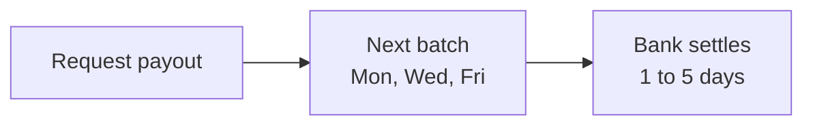

Pandabase pays out directly to your bank account. Once your identity is verified and a bank account is added, you can request payouts from your store's available balance.

Payouts are processed in batches on **Monday, Wednesday, and Friday**. Requests submitted between batches queue up and go out in the next batch.

<Note>
  Some payouts are approved instantly; others sit in the queue until the next
  scheduled batch. Both are normal. If your request hasn't moved yet, there's
  nothing to do, it'll be picked up automatically.
</Note>

## Minimum

The minimum payout amount is **$50.00** in all countries.

## Fees

Fees are calculated **at the time you request a payout** and depend on your bank's country, currency, and the rails used. Every payout has a $1.50 base fee; non-US destinations also incur cross-border and currency conversion fees.

You can preview the exact fee for any amount using the **estimate** action in the dashboard or via the API before confirming the request.

## Supported countries

Payouts are available everywhere we support stores. Local rails (ACH, SEPA, BECS, FPS, NEFT/IMPS) are used where available; remaining destinations settle over SWIFT.

<Accordion title="Supported countries">
  **Americas:** 🇨🇦 Canada, 🇺🇸 United States

  **Europe:** 🇦🇹 Austria, 🇧🇪 Belgium, 🇭🇷 Croatia, 🇨🇾 Cyprus, 🇨🇿 Czech Republic, 🇩🇰 Denmark, 🇪🇪 Estonia, 🇫🇮 Finland, 🇫🇷 France, 🇩🇪 Germany, 🇬🇧 Great Britain, 🇬🇷 Greece, 🇭🇺 Hungary, 🇮🇪 Ireland, 🇮🇹 Italy, 🇱🇻 Latvia, 🇱🇹 Lithuania, 🇱🇺 Luxembourg, 🇲🇹 Malta, 🇳🇱 Netherlands, 🇳🇴 Norway, 🇵🇱 Poland, 🇵🇹 Portugal, 🇷🇴 Romania, 🇸🇰 Slovakia, 🇸🇮 Slovenia, 🇪🇸 Spain, 🇸🇪 Sweden, 🇨🇭 Switzerland, 🇹🇷 Turkiye

  **Asia-Pacific:** 🇦🇺 Australia, 🇭🇰 Hong Kong, 🇮🇳 India, 🇳🇿 New Zealand, 🇵🇭 Philippines, 🇸🇬 Singapore, 🇹🇼 Taiwan, 🇹🇭 Thailand, 🇻🇳 Vietnam

  **Middle East:** 🇮🇱 Israel, 🇶🇦 Qatar, 🇦🇪 United Arab Emirates

  **Africa:** 🇲🇦 Morocco
</Accordion>

## New bank accounts

A new bank account enters an **In Review** state for 2 to 3 business days while we verify the details and run compliance checks. You can't request payouts during the review. We'll email you once it's approved.

After approval, your **first payout** has a 7 to 14 day waiting period before settlement, for risk mitigation. This applies to every new bank account, including replacement accounts after you change details.

## Settlement times

Subsequent payouts settle within **1 to 5 business days**, depending on your country. Local transfers typically clear in 1 to 2 business days; international wires take 3 to 5.

These ranges are typical, not guarantees. Some payouts arrive faster than the lower bound; others get delayed by interbank holidays, compliance reviews on the receiving side, or the bank's own processing windows.

<Note>
  Individual payout requests may be held for review. You'll receive an email
  with the status of your request.
</Note>

## Failed or returned payouts

If a payout is rejected by your bank (wrong details, closed account, compliance hold on the receiving side), our reconciliation and batch system **automatically returns the funds to your available balance within 15 days**. In some cases it can take up to **30 days**. You don't need to file anything; the credit happens on its own.

Once the funds are back in your balance, fix the bank details and request a new payout.

## Payout hasn't arrived?

Wait until at least **5 business days** have passed since the payout was marked as paid. Most local rails clear in 1 to 2 business days, but interbank delays are common and the funds usually land within this window.

If 5 business days have passed and you still don't see the deposit, contact your bank first. They can trace incoming transfers using the reference shown on the payout in your dashboard. If your bank confirms nothing has arrived, reach out to support with the payout ID.

