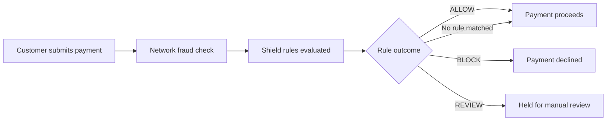

## Overview

Shield is Pandabase's fraud prevention engine. It runs on every payment before it's captured, evaluating your custom rules against transaction data in real time.

By default, Pandabase's network-level fraud detection protects all stores. Shield lets you go further — define your own rules to block, allow, or review payments based on attributes like email, country, card BIN, IP address, amount, and more.

Shield has two building blocks:

- **Lists** — named sets of values (emails, IPs, countries, card BINs) that rules can reference
- **Rules** — conditions written in Shield's rule syntax that decide what happens to a payment

## How it works



Rules are evaluated in priority order. The first rule that matches determines the outcome. If no rule matches, the payment proceeds normally.

## Lists

Lists are reusable collections of values that you reference in rules. Instead of writing a rule for every blocked email, you add emails to a list and write one rule that checks against it.

### List types

| Type       | Description                        | Example values                       |
| ---------- | ---------------------------------- | ------------------------------------ |
| `email`    | Customer email addresses           | `fraud@example.com`, `*@tempmail.io` |
| `ip`       | IPv4 or IPv6 addresses             | `192.168.1.1`, `10.0.0.0/8`         |
| `country`  | ISO 3166-1 alpha-2 country codes   | `US`, `NG`, `RU`                     |
| `card_bin` | First 6–8 digits of a card number  | `411111`, `55000000`                 |
| `string`   | Arbitrary string values            | Custom field values, user IDs        |

### Managing lists

Create lists in the dashboard under **Shield → Lists**, or via the API:

```bash
curl -X POST https://api.pandabase.io/v2/stores/{storeId}/shield/lists \
  -H "Authorization: Bearer sk_live_xxx" \
  -H "Content-Type: application/json" \
  -d '{
    "name": "blocked_emails",
    "type": "email",
    "values": [
      "fraud@example.com",
      "*@tempmail.io",
      "*@disposable.net"
    ]
  }'
```

You can add or remove values from a list at any time. Changes take effect on the next payment.

### Wildcard matching

Email and string lists support wildcard patterns:

| Pattern             | Matches                              |
| ------------------- | ------------------------------------ |
| `*@tempmail.io`     | Any email at tempmail.io             |
| `fraud@*`           | "fraud@" at any domain               |
| `*+promo@*`         | Any email with "+promo" before the @ |

### IP ranges

IP lists support CIDR notation for matching ranges:

| Pattern         | Matches                          |
| --------------- | -------------------------------- |
| `192.168.1.1`   | Exact IP                         |
| `10.0.0.0/8`    | All IPs in the 10.x.x.x range   |
| `2001:db8::/32` | IPv6 range                       |

## Rules

Rules define conditions and outcomes. Each rule has a **condition** (what to check), an **action** (what to do), and a **priority** (evaluation order).

### Actions

| Action   | Effect                                                                                         |
| -------- | ---------------------------------------------------------------------------------------------- |
| `ALLOW`  | Payment proceeds immediately. No further rules are evaluated.                                  |
| `BLOCK`  | Payment is declined. The customer sees a generic decline message.                              |
| `REVIEW` | Payment is held for manual review. You'll receive an email and can approve or decline from the dashboard. |

### Rule syntax

Rules use a simple expression syntax. Each rule is a single condition that evaluates to true or false.

#### Attributes

These attributes are available in every rule:

| Attribute              | Type    | Description                                      |
| ---------------------- | ------- | ------------------------------------------------ |
| `email`                | string  | Customer email address                           |
| `email_domain`         | string  | Domain part of the email (after @)               |
| `ip`                   | string  | Customer IP address                              |
| `country`              | string  | Two-letter country code from billing address      |
| `ip_country`           | string  | Two-letter country code from IP geolocation       |
| `card_bin`             | string  | First 6 digits of the card number                |
| `card_country`         | string  | Card issuing country                             |
| `card_funding`         | string  | `credit`, `debit`, or `prepaid`                  |
| `amount`               | integer | Payment amount in cents                          |
| `currency`             | string  | Three-letter currency code                       |
| `risk_score`           | integer | Pandabase risk score (0–100)                     |
| `is_new_customer`      | boolean | True if the customer has no prior completed orders |
| `customer_order_count` | integer | Number of completed orders by this customer       |
| `metadata.*`           | string  | Checkout metadata values (e.g. `metadata.source`) |

#### Operators

| Operator     | Types              | Example                                  |
| ------------ | ------------------ | ---------------------------------------- |
| `==`         | string, integer    | `country == "US"`                        |
| `!=`         | string, integer    | `card_funding != "prepaid"`              |
| `>`          | integer            | `amount > 50000`                         |
| `<`          | integer            | `amount < 100`                           |
| `>=`         | integer            | `risk_score >= 80`                       |
| `<=`         | integer            | `customer_order_count <= 1`              |
| `IN`         | string, list       | `email IN @blocked_emails`               |
| `NOT IN`     | string, list       | `country NOT IN @allowed_countries`      |
| `CONTAINS`   | string             | `email_domain CONTAINS "tempmail"`       |
| `STARTS_WITH`| string             | `email STARTS_WITH "test"`               |
| `ENDS_WITH`  | string             | `email_domain ENDS_WITH ".xyz"`          |

#### Combining conditions

Use `AND` and `OR` to combine conditions. Use parentheses for grouping.

```
amount > 10000 AND is_new_customer == true
```

```
(country == "US" OR country == "CA") AND card_funding == "prepaid"
```

```
risk_score >= 70 AND amount > 5000 AND is_new_customer == true
```

#### Referencing lists

Prefix a list name with `@` to reference it in a rule:

```
email IN @blocked_emails
```

```
country NOT IN @allowed_countries
```

```
ip IN @suspicious_ips AND amount > 20000
```

### Writing rules

#### Example: Block disposable emails

```
Action:    BLOCK
Priority:  1
Condition: email IN @disposable_emails
```

#### Example: Review high-value orders from new customers

```
Action:    REVIEW
Priority:  2
Condition: amount > 50000 AND is_new_customer == true
```

#### Example: Block prepaid cards over $200

```
Action:    BLOCK
Priority:  3
Condition: card_funding == "prepaid" AND amount > 20000
```

#### Example: Allow known good customers

```
Action:    ALLOW
Priority:  0
Condition: customer_order_count >= 10
```

#### Example: Review when billing and IP country don't match

```
Action:    REVIEW
Priority:  4
Condition: country != ip_country AND amount > 5000
```

#### Example: Block specific card BINs

```
Action:    BLOCK
Priority:  5
Condition: card_bin IN @blocked_bins
```

#### Example: Review high risk scores

```
Action:    REVIEW
Priority:  6
Condition: risk_score >= 75
```

### Creating rules via API

```bash
curl -X POST https://api.pandabase.io/v2/stores/{storeId}/shield/rules \
  -H "Authorization: Bearer sk_live_xxx" \
  -H "Content-Type: application/json" \
  -d '{
    "name": "Block disposable emails",
    "condition": "email IN @disposable_emails",
    "action": "BLOCK",
    "priority": 1,
    "enabled": true
  }'
```

### Priority

Rules are evaluated from lowest to highest priority number. The first matching rule wins.

| Priority | Rule                                | Action |
| -------- | ----------------------------------- | ------ |
| 0        | `customer_order_count >= 10`        | ALLOW  |
| 1        | `email IN @disposable_emails`       | BLOCK  |
| 2        | `amount > 50000 AND is_new_customer == true` | REVIEW |
| 3        | `risk_score >= 75`                  | REVIEW |

In this setup, a repeat customer with 10+ orders is always allowed through — even if their email is on the disposable list or the amount is high. Priority 0 matches first.

<Warning>
  Be careful with ALLOW rules at low priority numbers. An overly broad ALLOW rule can bypass all your other protections.
</Warning>

## Review queue

Payments that match a `REVIEW` rule are held and appear in the **Shield → Review** queue in your dashboard. From there you can:

- **Approve** — the payment proceeds and the order is completed
- **Decline** — the payment is cancelled and the customer is refunded
- **Add to list** — add the customer's email, IP, or card BIN to a list for future rules

Payments in review are held for up to **72 hours**. If no action is taken, the payment is automatically declined and the customer is refunded.

<Note>
  You'll receive an email and a `PAYMENT_REVIEW` webhook event when a payment is held for review.
</Note>

## Best practices

- **Start with REVIEW, not BLOCK.** When testing new rules, use REVIEW first to see what they catch before switching to BLOCK.
- **Use lists for values that change.** Instead of hardcoding emails or IPs into rule conditions, use lists. You can update lists without editing rules.
- **Keep priority order intentional.** Put ALLOW rules for trusted customers at the top. Put broad catch-all rules (like high risk score) at the bottom.
- **Monitor your review queue.** Payments in review expire after 72 hours. Check the queue regularly or set up the `PAYMENT_REVIEW` webhook.
- **Don't over-block.** Aggressive rules hurt legitimate customers. Track your block rate in **Shield → Analytics** and adjust if too many good payments are being declined.
- **Use country mismatches carefully.** Many legitimate customers use VPNs or travel. A country mismatch rule should REVIEW, not BLOCK.
