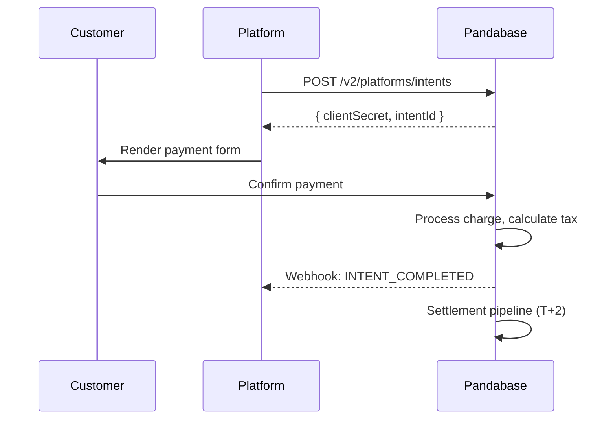
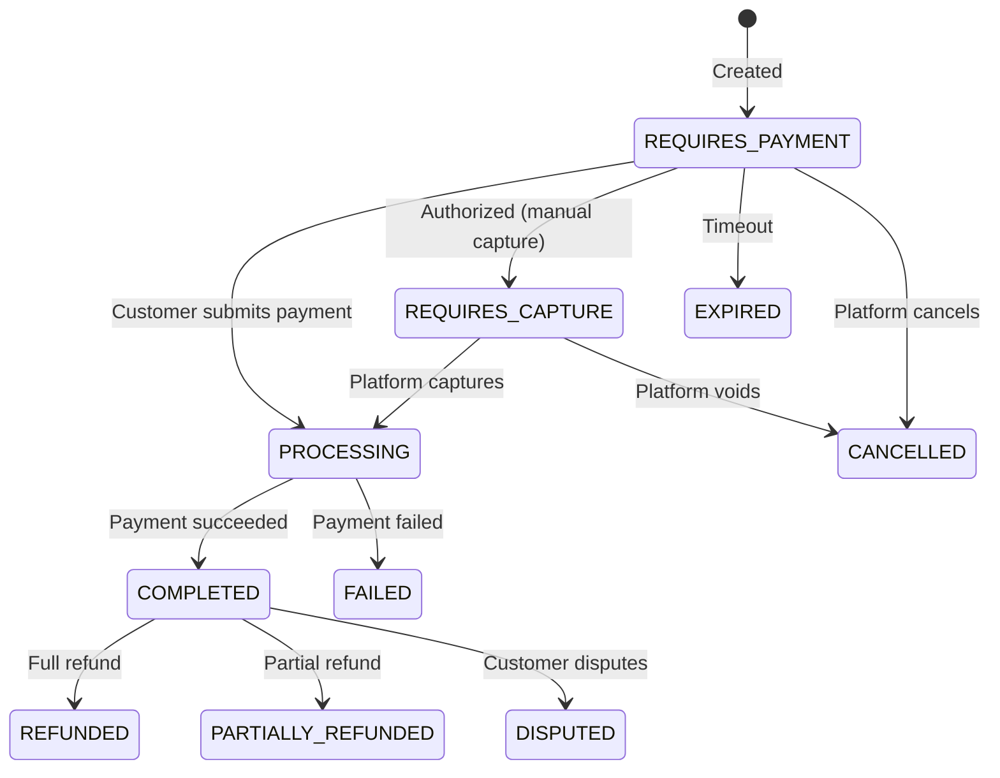

<Warning>
  Platform Intents is in **private beta** and requires approval. Contact
  [platforms@pandabase.io](mailto:platforms@pandabase.io) to request access.
</Warning>

## Overview

A Platform Intent represents a payment your platform wants to collect on behalf of a merchant. It is the central object in the Platform API, tracking the full lifecycle from creation through settlement.

When you create an intent, Pandabase returns a `clientSecret` that your frontend uses to render a payment form. The customer pays through Pandabase.js or the hosted payment page. Once the payment completes, Pandabase processes settlement to the merchant and accumulates your platform fee.



## Authentication

All Platform Intent requests require dual authentication: your platform signature and the merchant context.

```
Authorization: Platform plt_your_platform_id
X-Platform-Signature: HMAC-SHA512(psk_secret, canonical_request)
X-Merchant-Context: shp_merchant_store_id
X-Request-Timestamp: 1679000000000
X-Idempotency-Key: unique_request_id
```

### Canonical request signing

Platform signatures use HMAC-SHA512 (not SHA-256). The signing payload is constructed from the request method, path, timestamp, and a SHA-256 hash of the request body.

```typescript
import crypto from "crypto";

function signPlatformRequest(
  method: string,
  path: string,
  body: string,
  timestamp: number,
  secret: string,
): string {
  const canonicalRequest = [
    method.toUpperCase(),
    path,
    timestamp.toString(),
    crypto
      .createHash("sha256")
      .update(body || "")
      .digest("hex"),
  ].join("\n");

  return crypto
    .createHmac("sha512", secret)
    .update(canonicalRequest)
    .digest("hex");
}
```

```go
package pandabase

import (
	"crypto/hmac"
	"crypto/sha256"
	"crypto/sha512"
	"encoding/hex"
	"fmt"
	"strings"
)

func SignPlatformRequest(method, path, body string, timestamp int64, secret string) string {
	bodyHash := sha256.Sum256([]byte(body))
	canonical := strings.Join([]string{
		strings.ToUpper(method),
		path,
		fmt.Sprintf("%d", timestamp),
		hex.EncodeToString(bodyHash[:]),
	}, "\n")

	mac := hmac.New(sha512.New, []byte(secret))
	mac.Write([]byte(canonical))
	return hex.EncodeToString(mac.Sum(nil))
}
```

<Warning>
  Platform signatures use **SHA-512**, not SHA-256. Requests signed with SHA-256
  will be rejected with a `SIGNATURE_MISMATCH` error. The signing key is your
  raw `psk_` secret. Do not hash it before use.
</Warning>

## Creating an intent

```bash
POST /v2/platforms/intents
Authorization: Platform plt_xxx
X-Platform-Signature: {signature}
X-Merchant-Context: shp_provisioned_xxx
X-Idempotency-Key: intent_abc123
X-Request-Timestamp: 1679000000000

{
  "amount": 4999,
  "currency": "USD",
  "description": "Pro Plan, Monthly",
  "customer": {
    "email": "buyer@example.com",
    "name": "Jane Doe"
  },
  "lineItems": [
    {
      "name": "Pro Plan",
      "amount": 4999,
      "quantity": 1
    }
  ],
  "platformFee": 500,
  "metadata": {
    "platformOrderId": "order_12345",
    "planId": "pro_monthly"
  },
  "returnUrl": "https://yourplatform.com/payments/success",
  "cancelUrl": "https://yourplatform.com/payments/cancelled",
  "expiresIn": 3600
}
```

Response:

```json
{
  "ok": true,
  "data": {
    "intentId": "pti_cm5x7k2a000001j0g8h3f9d2e",
    "clientSecret": "pti_cm5x7k2a000001j0g8h3f9d2e_secret_xxx",
    "status": "REQUIRES_PAYMENT",
    "amount": 4999,
    "currency": "USD",
    "feeBreakdown": {
      "pandabaseFee": 315,
      "platformFee": 500,
      "processingFee": 175,
      "merchantReceives": 4009
    },
    "paymentUrl": "https://pay.pandabase.io/intents/pti_cm5x7k2a000001j0g8h3f9d2e",
    "expiresAt": "2026-03-20T13:00:00.000Z",
    "createdAt": "2026-03-20T12:00:00.000Z"
  }
}
```

### Required fields

| Field            | Type    | Description                                                                                  |
| ---------------- | ------- | -------------------------------------------------------------------------------------------- |
| `amount`         | integer | Amount in cents. Minimum 100 ($1.00).                                                        |
| `currency`       | string  | Three-letter ISO 4217 currency code. Currently only `USD` is supported for platform intents. |
| `customer.email` | string  | Customer email address. Used for receipts and dispute evidence.                              |
| `lineItems`      | array   | At least one line item is required. The sum of line items must equal `amount`.               |
| `returnUrl`      | string  | Where the customer is redirected after successful payment.                                   |

### Optional fields

| Field                 | Type    | Default       | Description                                                                                                            |
| --------------------- | ------- | ------------- | ---------------------------------------------------------------------------------------------------------------------- |
| `description`         | string  |               | Human-readable description shown on the payment page and in receipts. Max 500 characters.                              |
| `customer.name`       | string  |               | Customer full name. Included in receipts and dispute evidence.                                                         |
| `platformFee`         | integer | 0             | Your platform's fee in cents. Cannot exceed 30% of `amount`.                                                           |
| `metadata`            | object  | `{}`          | Arbitrary key-value pairs. Max 20 keys, key max 40 characters, value max 500 characters. Included in webhook payloads. |
| `cancelUrl`           | string  |               | Where the customer is redirected if they cancel the payment.                                                           |
| `expiresIn`           | integer | 3600          | Time in seconds until the intent expires. Min 300 (5 minutes), max 86400 (24 hours).                                   |
| `captureMethod`       | string  | `automatic`   | `automatic` captures immediately. `manual` authorizes only; you must capture within 7 days.                            |
| `statementDescriptor` | string  | Merchant name | Text that appears on the customer's bank statement. Max 22 characters.                                                 |

### Line items

Each line item requires:

| Field      | Type    | Description                                   |
| ---------- | ------- | --------------------------------------------- |
| `name`     | string  | Display name of the item. Max 256 characters. |
| `amount`   | integer | Unit price in cents.                          |
| `quantity` | integer | Quantity of this item. Must be at least 1.    |

Optional line item fields:

| Field         | Type   | Description                                           |
| ------------- | ------ | ----------------------------------------------------- |
| `description` | string | Additional detail about the item. Max 500 characters. |
| `externalId`  | string | Your internal product or SKU identifier.              |

## Fee structure

| Component         | Calculation                             | Description                                              |
| ----------------- | --------------------------------------- | -------------------------------------------------------- |
| Pandabase MoR fee | 5.9% + 20c                              | Covers payment processing, tax, compliance, and disputes |
| Processing fee    | Dynamic                                 | Payment method specific (included in the MoR fee)        |
| Platform fee      | Set by you                              | Your revenue per transaction                             |
| Merchant receives | Amount minus MoR fee minus platform fee | Net settlement to the merchant                           |

<Warning>
  Platform fees cannot exceed 30% of the transaction amount. Platforms that
  consistently set fees above 15% may be flagged for review by the compliance
  team.
</Warning>

### Fee calculation example

For a $50.00 intent with a $5.00 platform fee:

| Component                        | Amount |
| -------------------------------- | ------ |
| Customer pays                    | $50.00 |
| Pandabase MoR fee (5.9% + $0.20) | $3.15  |
| Platform fee                     | $5.00  |
| Merchant receives                | $41.85 |

## Intent statuses

| Status               | Description                                          | Terminal |
| -------------------- | ---------------------------------------------------- | :------: |
| `REQUIRES_PAYMENT`   | Created, awaiting customer payment                   |    No    |
| `REQUIRES_CAPTURE`   | Authorized (manual capture mode), awaiting capture   |    No    |
| `PROCESSING`         | Payment is being processed by the payment network    |    No    |
| `COMPLETED`          | Payment succeeded, settlement pending                |    No    |
| `FAILED`             | Payment failed (declined, insufficient funds, etc.)  |   Yes    |
| `EXPIRED`            | Intent expired before the customer completed payment |   Yes    |
| `CANCELLED`          | Cancelled by the platform before payment             |   Yes    |
| `REFUNDED`           | Payment was refunded in full                         |   Yes    |
| `PARTIALLY_REFUNDED` | Payment was partially refunded                       |    No    |
| `DISPUTED`           | Customer opened a dispute with their bank            |    No    |



## Retrieving an intent

```bash
GET /v2/platforms/intents/{intentId}
Authorization: Platform plt_xxx
X-Platform-Signature: {signature}
```

Response:

```json
{
  "ok": true,
  "data": {
    "intentId": "pti_cm5x7k2a000001j0g8h3f9d2e",
    "merchantId": "shp_provisioned_xxx",
    "status": "COMPLETED",
    "amount": 4999,
    "currency": "USD",
    "description": "Pro Plan, Monthly",
    "customer": {
      "email": "buyer@example.com",
      "name": "Jane Doe"
    },
    "lineItems": [
      {
        "name": "Pro Plan",
        "amount": 4999,
        "quantity": 1
      }
    ],
    "feeBreakdown": {
      "pandabaseFee": 315,
      "platformFee": 500,
      "processingFee": 175,
      "merchantReceives": 4009
    },
    "metadata": {
      "platformOrderId": "order_12345",
      "planId": "pro_monthly"
    },
    "settlement": {
      "status": "PENDING",
      "expectedAt": "2026-03-22T08:00:00.000Z"
    },
    "paymentMethod": {
      "type": "card",
      "brand": "visa",
      "last4": "4242",
      "expiryMonth": 12,
      "expiryYear": 2028
    },
    "createdAt": "2026-03-20T12:00:00.000Z",
    "completedAt": "2026-03-20T12:05:00.000Z"
  }
}
```

## Listing intents

```bash
GET /v2/platforms/intents?merchantId=shp_xxx&status=COMPLETED&page=1&limit=25
Authorization: Platform plt_xxx
X-Platform-Signature: {signature}
```

### Query parameters

| Parameter    | Type    | Default | Description                                                           |
| ------------ | ------- | ------- | --------------------------------------------------------------------- |
| `merchantId` | string  |         | Filter by merchant. If omitted, returns intents across all merchants. |
| `status`     | string  | All     | Filter by intent status                                               |
| `from`       | string  |         | Start date (ISO 8601)                                                 |
| `to`         | string  |         | End date (ISO 8601)                                                   |
| `customerId` | string  |         | Filter by customer email                                              |
| `page`       | integer | 1       | Page number                                                           |
| `limit`      | integer | 25      | Items per page (max 100)                                              |

## Cancelling an intent

Cancel an intent that has not yet been paid:

```bash
POST /v2/platforms/intents/{intentId}/cancel
Authorization: Platform plt_xxx
X-Platform-Signature: {signature}
X-Merchant-Context: shp_provisioned_xxx

{
  "reason": "Customer requested cancellation"
}
```

Only intents in `REQUIRES_PAYMENT` or `REQUIRES_CAPTURE` status can be cancelled.

## Manual capture

When `captureMethod` is set to `manual`, the payment is authorized but not captured. This is useful when you need to verify the order before charging the customer.

### Capturing an authorized intent

```bash
POST /v2/platforms/intents/{intentId}/capture
Authorization: Platform plt_xxx
X-Platform-Signature: {signature}
X-Merchant-Context: shp_provisioned_xxx

{
  "amount": 4999
}
```

The `amount` field is optional. If omitted, the full authorized amount is captured. You can capture a lower amount (partial capture), but not a higher one.

<Warning>
  Authorized intents must be captured within **7 days**. Uncaptured
  authorizations are automatically voided after this window.
</Warning>

## Refunding an intent

```bash
POST /v2/platforms/intents/{intentId}/refund
Authorization: Platform plt_xxx
X-Platform-Signature: {signature}
X-Merchant-Context: shp_provisioned_xxx

{
  "amount": 4999,
  "reason": "Customer requested refund"
}
```

### Refund rules

- Full and partial refunds are supported
- Refunds must be issued within 180 days of the original payment
- The merchant's balance must have sufficient funds to cover the refund
- The Pandabase MoR fee is not returned on refund
- Platform fee refund behavior is configurable per platform (contact support)

### Refund response

```json
{
  "ok": true,
  "data": {
    "refundId": "ref_xxx",
    "intentId": "pti_cm5x7k2a000001j0g8h3f9d2e",
    "amount": 4999,
    "status": "PROCESSING",
    "reason": "Customer requested refund",
    "createdAt": "2026-03-20T15:00:00.000Z"
  }
}
```

## Frontend integration

### Pandabase.js (recommended)

Embed a payment form directly into your platform using Pandabase.js. This gives you full control over the payment experience while Pandabase handles PCI compliance.

```html
<script src="https://js.pandabase.io/v2/platform.js"></script>
```

```javascript
const pandabase = Pandabase.init("plt_xxx", { mode: "production" });

// Create the intent on your backend first
const { intentId, clientSecret } = await fetch("/api/create-intent", {
  method: "POST",
  body: JSON.stringify({ productId: "prod_123" }),
}).then((r) => r.json());

// Mount the payment element
const payment = pandabase.createPaymentElement({
  clientSecret,
  appearance: {
    theme: "auto",
    variables: {
      colorPrimary: "#0071e3",
      borderRadius: "8px",
      fontFamily: "Inter, sans-serif",
    },
  },
  layout: {
    type: "tabs",
    defaultCollapsed: false,
  },
});

payment.mount("#payment-container");

// Listen for events
payment.on("ready", () => {
  console.log("Payment form rendered");
});

payment.on("change", (event) => {
  // event.complete is true when the form is fully filled
  submitButton.disabled = !event.complete;
});

payment.on("complete", (result) => {
  if (result.status === "COMPLETED") {
    window.location.href = "/success?order=" + result.intentId;
  }
});

payment.on("error", (error) => {
  showError(error.message);
});
```

### Appearance options

| Variable          | Description                               |
| ----------------- | ----------------------------------------- |
| `colorPrimary`    | Primary button and accent color           |
| `colorBackground` | Form background color                     |
| `colorText`       | Primary text color                        |
| `colorDanger`     | Error and validation message color        |
| `borderRadius`    | Border radius for inputs and buttons      |
| `fontFamily`      | Font family for all text                  |
| `fontSizeBase`    | Base font size                            |
| `spacingUnit`     | Base spacing unit for padding and margins |

### Hosted payment page

For simpler integrations, redirect customers to the hosted payment URL returned when the intent is created:

```javascript
const response = await fetch("/api/create-intent", {
  method: "POST",
  body: JSON.stringify({ productId: "prod_123" }),
}).then((r) => r.json());

window.location.href = response.paymentUrl;
```

The hosted page handles the full payment flow and redirects the customer to your `returnUrl` or `cancelUrl` when complete.

## Webhooks

Platform webhooks are delivered to your registered platform endpoint. All webhook payloads are signed with HMAC-SHA512 using your platform secret.

### Webhook events

| Event                       | Description                              |
| --------------------------- | ---------------------------------------- |
| `INTENT_CREATED`            | Intent created, awaiting payment         |
| `INTENT_PROCESSING`         | Payment is being processed               |
| `INTENT_COMPLETED`          | Payment collected successfully           |
| `INTENT_FAILED`             | Payment failed                           |
| `INTENT_EXPIRED`            | Intent expired before payment            |
| `INTENT_CANCELLED`          | Intent cancelled by platform             |
| `INTENT_REFUNDED`           | Full refund issued                       |
| `INTENT_PARTIALLY_REFUNDED` | Partial refund issued                    |
| `INTENT_DISPUTED`           | Customer opened a dispute                |
| `INTENT_DISPUTE_WON`        | Dispute resolved in the merchant's favor |
| `INTENT_DISPUTE_LOST`       | Dispute resolved in the customer's favor |

### Example webhook payload

```json
{
  "event": "INTENT_COMPLETED",
  "platformId": "plt_xxx",
  "merchantId": "shp_provisioned_xxx",
  "intentId": "pti_cm5x7k2a000001j0g8h3f9d2e",
  "timestamp": "2026-03-20T12:05:00.000Z",
  "data": {
    "amount": 4999,
    "currency": "USD",
    "feeBreakdown": {
      "pandabaseFee": 315,
      "platformFee": 500,
      "merchantReceives": 4184
    },
    "customer": {
      "email": "buyer@example.com",
      "name": "Jane Doe"
    },
    "lineItems": [
      {
        "name": "Pro Plan",
        "amount": 4999,
        "quantity": 1
      }
    ],
    "paymentMethod": {
      "type": "card",
      "brand": "visa",
      "last4": "4242"
    },
    "metadata": {
      "platformOrderId": "order_12345"
    }
  },
  "signature": {
    "algorithm": "HMAC-SHA512",
    "timestamp": 1679000000000
  }
}
```

### Verifying webhook signatures

```typescript
import crypto from "crypto";

function verifyPlatformWebhook(
  rawBody: string,
  signature: string,
  timestamp: string,
  secret: string,
): boolean {
  const expected = crypto
    .createHmac("sha512", secret)
    .update(timestamp + "." + rawBody)
    .digest("hex");

  return crypto.timingSafeEqual(
    Buffer.from(signature, "hex"),
    Buffer.from(expected, "hex"),
  );
}
```

<Tip>
  Always verify webhook signatures before processing. Return a `200` status
  immediately and process the event asynchronously to avoid timeouts.
</Tip>

## Error codes

| Code                          | Status | Description                                                    |
| ----------------------------- | ------ | -------------------------------------------------------------- |
| `MERCHANT_NOT_ACTIVE`         | 403    | The merchant is not in `ACTIVE` status                         |
| `MERCHANT_CAPABILITY_MISSING` | 403    | The merchant does not have the `payments` capability           |
| `AMOUNT_TOO_LOW`              | 400    | Amount is below the $1.00 minimum                              |
| `AMOUNT_TOO_HIGH`             | 400    | Amount exceeds the merchant's transaction limit                |
| `PLATFORM_FEE_TOO_HIGH`       | 400    | Platform fee exceeds 30% of the amount                         |
| `LINE_ITEMS_MISMATCH`         | 400    | Line item amounts do not sum to the intent amount              |
| `INTENT_NOT_FOUND`            | 404    | No intent found with the given ID                              |
| `INTENT_NOT_CANCELLABLE`      | 409    | Intent is not in a cancellable status                          |
| `INTENT_ALREADY_CAPTURED`     | 409    | Intent has already been captured                               |
| `INTENT_CAPTURE_EXPIRED`      | 409    | The 7-day capture window has passed                            |
| `REFUND_EXCEEDS_AMOUNT`       | 400    | Refund amount exceeds the remaining refundable amount          |
| `INSUFFICIENT_BALANCE`        | 400    | Merchant balance is insufficient for the refund                |
| `SIGNATURE_MISMATCH`          | 401    | The platform signature does not match                          |
| `TIMESTAMP_EXPIRED`           | 401    | The request timestamp is older than 5 minutes                  |
| `IDEMPOTENCY_CONFLICT`        | 409    | A different request was already made with this idempotency key |
