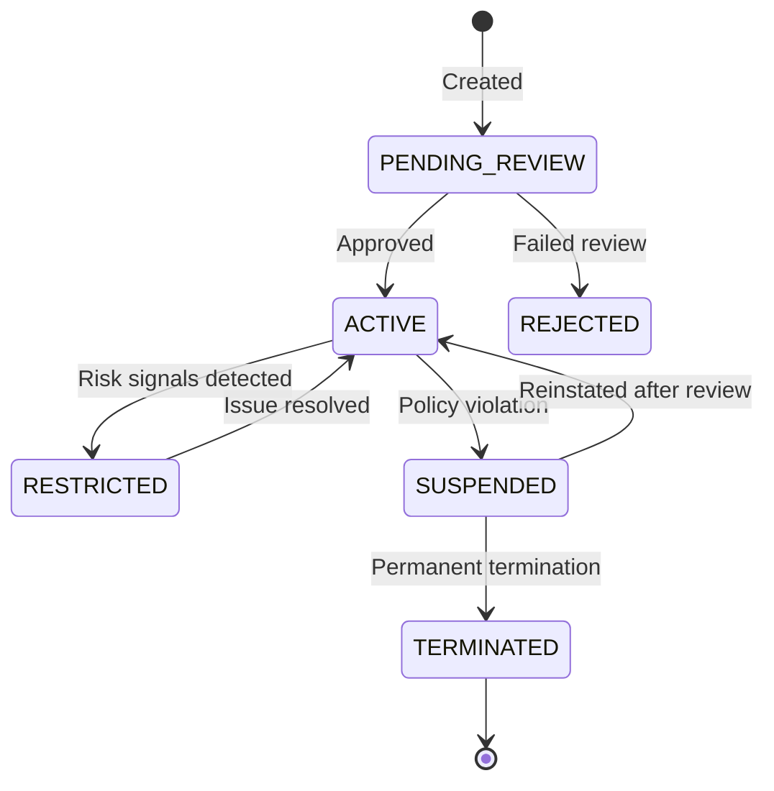

<Warning>
  Merchant Provisioning is in **private beta**. Requires an approved Platform
  Partner account.
</Warning>

## Overview

When a new seller joins your platform, you provision them as a merchant sub-account through the Provisioning API. Pandabase creates a store on their behalf and handles all KYC/KYB verification through the [Pandabase.js Verification SDK](/platforms/compliance#merchant-onboarding-and-verification). Once verification passes, payment capabilities are activated based on the onboarding tier you select.

Each merchant maps to an isolated Pandabase store with its own balance, transaction history, and compliance status. Your platform maintains full control over merchant lifecycle events through the API.

## Creating a merchant

```bash
POST /v2/platforms/merchants
Authorization: Platform plt_xxx
X-Platform-Signature: {signature}
X-Idempotency-Key: merchant_create_abc123

{
  "externalId": "your_internal_merchant_id",
  "businessName": "Coffee Shop Co",
  "email": "owner@coffeeshop.co",
  "country": "US",
  "category": "DIGITAL_PRODUCTS",
  "onboardingTier": "STANDARD",
  "capabilities": {
    "payments": true,
    "subscriptions": false,
    "payouts": true
  },
  "riskProfile": {
    "expectedMonthlyVolume": "FROM_1K_TO_10K",
    "averageTransactionSize": 1500,
    "businessModel": "B2C"
  },
  "metadata": {
    "planId": "pro",
    "signupSource": "website"
  }
}
```

Response:

```json
{
  "ok": true,
  "data": {
    "merchantId": "shp_provisioned_xxx",
    "platformId": "plt_xxx",
    "externalId": "your_internal_merchant_id",
    "status": "PENDING_REVIEW",
    "onboardingTier": "STANDARD",
    "capabilities": {
      "payments": "PENDING",
      "subscriptions": "DISABLED",
      "payouts": "PENDING"
    },
    "limits": {
      "maxTransactionAmount": 50000,
      "dailyVolumeCap": 500000,
      "monthlyVolumeCap": 5000000
    },
    "createdAt": "2026-03-20T10:00:00.000Z"
  }
}
```

### Required fields

| Field | Type | Description |
|-------|------|-------------|
| `externalId` | string | Your internal identifier for this merchant. Must be unique per platform. Max 128 characters. |
| `businessName` | string | Display name of the merchant's business. Max 256 characters. |
| `email` | string | Primary contact email. Must be a valid, deliverable address. |
| `country` | string | ISO 3166-1 alpha-2 country code. Must be a [supported country](/guides/payouts). |
| `category` | string | Business category. See [categories](#merchant-categories) below. |
| `onboardingTier` | string | The review tier for this merchant. See [onboarding tiers](#onboarding-tiers). |

### Optional fields

| Field | Type | Description |
|-------|------|-------------|
| `capabilities` | object | Capabilities to request. Defaults to `{ payments: true }`. |
| `riskProfile` | object | Expected volume and transaction patterns. Helps accelerate compliance review. |
| `metadata` | object | Arbitrary key-value pairs. Max 20 keys, key max 40 characters, value max 500 characters. |
| `notificationEmail` | string | Separate email for operational notifications. Defaults to `email`. |
| `webhookUrl` | string | Merchant-specific webhook endpoint. If not set, all events go to your platform webhook. |

<Note>
  Always include an `X-Idempotency-Key` header when creating merchants. If a
  request is retried with the same key, Pandabase returns the existing merchant
  instead of creating a duplicate.
</Note>

## Onboarding tiers

Tiers control the level of compliance review and the volume limits applied to a merchant.

| Tier | Review time | Monthly volume cap | Transaction cap | Requirements |
|------|------------|-------------------|----------------|-------------|
| `EXPRESS` | Instant | $5,000 | $500 | Email verification only |
| `STANDARD` | Under 24 hours | $50,000 | $5,000 | Basic KYB review |
| `ENHANCED` | 2 to 5 business days | $500,000 | $50,000 | Full KYB with document verification |
| `ENTERPRISE` | Custom | Unlimited | Unlimited | Dedicated compliance review |

`EXPRESS` is designed for fast onboarding with strict limits. Merchants can be upgraded to a higher tier at any time by submitting a tier change request.

### Upgrading a merchant's tier

```bash
POST /v2/platforms/merchants/{merchantId}/tier
Authorization: Platform plt_xxx
X-Platform-Signature: {signature}

{
  "tier": "ENHANCED",
  "documents": {
    "businessRegistration": "doc_upload_xxx",
    "governmentId": "doc_upload_yyy"
  }
}
```

Tier upgrades trigger a new compliance review. The merchant retains their current capabilities and limits until the upgrade is approved or rejected. You will receive a `MERCHANT_TIER_UPDATED` webhook on resolution.

## Merchant categories

| Category | Description |
|----------|-------------|
| `DIGITAL_PRODUCTS` | Software, e-books, digital downloads |
| `SAAS` | Software as a service, subscriptions |
| `EDUCATION` | Courses, tutorials, educational content |
| `MEDIA` | Music, video, streaming, digital media |
| `GAMING` | Games, in-game items, game keys |
| `SERVICES` | Consulting, freelance, professional services |
| `COMMUNITY` | Memberships, communities, forums |
| `OTHER` | Anything that does not fit the above categories |

The category influences the risk scoring applied during compliance review. Selecting the correct category speeds up the review process.

## Merchant lifecycle



### Statuses

| Status | Description | Can process payments | Can receive payouts |
|--------|-------------|:---:|:---:|
| `PENDING_REVIEW` | Awaiting compliance review | No | No |
| `ACTIVE` | Fully operational | Yes | Yes |
| `RESTRICTED` | Limited due to risk signals or compliance issues | Limited | Held |
| `SUSPENDED` | Suspended pending investigation | No | Held |
| `REJECTED` | Failed compliance review. Cannot be reactivated. | No | No |
| `TERMINATED` | Permanently removed from the platform | No | No |

When a merchant enters `RESTRICTED` status, existing payment intents in `REQUIRES_PAYMENT` are paused and new intents cannot be created. Completed settlements may be held during the restriction period.

## Capabilities

Each merchant has granular capabilities that your platform controls. Capabilities go through a review process before activation.

| Capability | Description | Minimum tier |
|-----------|-------------|-------------|
| `payments` | Accept one-time payments | EXPRESS |
| `subscriptions` | Accept recurring payments | STANDARD |
| `payouts` | Receive bank payouts | STANDARD |
| `disputes` | Self-manage dispute evidence | STANDARD |

### Capability statuses

| Status | Description |
|--------|-------------|
| `PENDING` | Under review by the compliance team |
| `ACTIVE` | Live and usable |
| `RESTRICTED` | Temporarily limited due to risk signals |
| `SUSPENDED` | Suspended pending investigation |
| `DISABLED` | Not enabled for this merchant |

### Requesting additional capabilities

```bash
POST /v2/platforms/merchants/{merchantId}/capabilities
Authorization: Platform plt_xxx
X-Platform-Signature: {signature}

{
  "capabilities": ["subscriptions", "payouts"]
}
```

Response:

```json
{
  "ok": true,
  "data": {
    "merchantId": "shp_provisioned_xxx",
    "capabilities": {
      "payments": "ACTIVE",
      "subscriptions": "PENDING",
      "payouts": "PENDING",
      "disputes": "DISABLED"
    },
    "updatedAt": "2026-03-20T10:30:00.000Z"
  }
}
```

New capabilities go through review before activation. You will receive a `MERCHANT_CAPABILITY_UPDATED` webhook when the status changes.

## Retrieving a merchant

```bash
GET /v2/platforms/merchants/{merchantId}
Authorization: Platform plt_xxx
X-Platform-Signature: {signature}
```

Response:

```json
{
  "ok": true,
  "data": {
    "merchantId": "shp_provisioned_xxx",
    "platformId": "plt_xxx",
    "externalId": "your_internal_merchant_id",
    "businessName": "Coffee Shop Co",
    "email": "owner@coffeeshop.co",
    "country": "US",
    "category": "DIGITAL_PRODUCTS",
    "status": "ACTIVE",
    "onboardingTier": "STANDARD",
    "capabilities": {
      "payments": "ACTIVE",
      "subscriptions": "DISABLED",
      "payouts": "ACTIVE",
      "disputes": "DISABLED"
    },
    "limits": {
      "maxTransactionAmount": 50000,
      "dailyVolumeCap": 500000,
      "monthlyVolumeCap": 5000000
    },
    "volume": {
      "currentMonth": 12500,
      "currentDay": 2500
    },
    "metadata": {
      "planId": "pro",
      "signupSource": "website"
    },
    "createdAt": "2026-03-20T10:00:00.000Z",
    "activatedAt": "2026-03-20T14:00:00.000Z"
  }
}
```

## Listing merchants

```bash
GET /v2/platforms/merchants?status=ACTIVE&page=1&limit=25
Authorization: Platform plt_xxx
X-Platform-Signature: {signature}
```

### Query parameters

| Parameter | Type | Default | Description |
|----------|------|---------|-------------|
| `status` | string | All | Filter by status: `PENDING_REVIEW`, `ACTIVE`, `RESTRICTED`, `SUSPENDED`, `REJECTED`, `TERMINATED` |
| `search` | string | | Search by business name or email |
| `country` | string | | Filter by ISO 3166-1 alpha-2 country code |
| `category` | string | | Filter by merchant category |
| `tier` | string | | Filter by onboarding tier |
| `page` | integer | 1 | Page number |
| `limit` | integer | 25 | Items per page (max 100) |

Response:

```json
{
  "ok": true,
  "data": {
    "items": [
      {
        "merchantId": "shp_provisioned_xxx",
        "externalId": "your_internal_merchant_id",
        "businessName": "Coffee Shop Co",
        "status": "ACTIVE",
        "onboardingTier": "STANDARD",
        "country": "US",
        "createdAt": "2026-03-20T10:00:00.000Z"
      }
    ],
    "pagination": {
      "page": 1,
      "limit": 25,
      "total": 48,
      "totalPages": 2
    }
  }
}
```

## Updating a merchant

```bash
PATCH /v2/platforms/merchants/{merchantId}
Authorization: Platform plt_xxx
X-Platform-Signature: {signature}

{
  "businessName": "Coffee Shop Co (Updated)",
  "metadata": {
    "planId": "enterprise"
  }
}
```

### Updatable fields

| Field | Re-review required |
|-------|--------------------|
| `businessName` | No |
| `email` | No |
| `notificationEmail` | No |
| `webhookUrl` | No |
| `metadata` | No |
| `country` | Yes |
| `category` | Yes |

<Warning>
  Changing a merchant's `country` or `category` triggers a compliance re-review.
  The merchant's capabilities may be temporarily restricted until the review
  completes.
</Warning>

## Suspending a merchant

```bash
POST /v2/platforms/merchants/{merchantId}/suspend
Authorization: Platform plt_xxx
X-Platform-Signature: {signature}

{
  "reason": "Terms of service violation",
  "holdSettlements": true
}
```

Suspended merchants cannot process new payments. The `holdSettlements` flag controls whether pending settlements are also frozen during the suspension.

To reinstate a suspended merchant:

```bash
POST /v2/platforms/merchants/{merchantId}/reinstate
Authorization: Platform plt_xxx
X-Platform-Signature: {signature}

{
  "reason": "Issue resolved after investigation"
}
```

Reinstatement restores the merchant to `ACTIVE` status and releases any held settlements. Merchants in `TERMINATED` status cannot be reinstated.

## Merchant webhooks

| Event | Description |
|-------|-------------|
| `MERCHANT_CREATED` | Merchant sub-account provisioned |
| `MERCHANT_ACTIVATED` | Compliance review passed, merchant is live |
| `MERCHANT_REJECTED` | Compliance review failed |
| `MERCHANT_RESTRICTED` | Merchant capabilities restricted due to risk signals |
| `MERCHANT_SUSPENDED` | Merchant suspended by platform or Pandabase |
| `MERCHANT_REINSTATED` | Merchant reinstated after suspension |
| `MERCHANT_TERMINATED` | Merchant permanently removed |
| `MERCHANT_CAPABILITY_UPDATED` | A capability status changed |
| `MERCHANT_TIER_UPDATED` | Onboarding tier upgrade approved or rejected |

### Example webhook payload

```json
{
  "event": "MERCHANT_ACTIVATED",
  "platformId": "plt_xxx",
  "merchantId": "shp_provisioned_xxx",
  "timestamp": "2026-03-20T14:00:00.000Z",
  "data": {
    "externalId": "your_internal_merchant_id",
    "status": "ACTIVE",
    "capabilities": {
      "payments": "ACTIVE",
      "subscriptions": "DISABLED",
      "payouts": "ACTIVE",
      "disputes": "DISABLED"
    },
    "limits": {
      "maxTransactionAmount": 50000,
      "dailyVolumeCap": 500000,
      "monthlyVolumeCap": 5000000
    }
  }
}
```

## Error codes

| Code | Status | Description |
|------|--------|-------------|
| `MERCHANT_ALREADY_EXISTS` | 409 | A merchant with this `externalId` already exists on your platform |
| `INVALID_COUNTRY` | 400 | The country code is not supported for merchant provisioning |
| `INVALID_CATEGORY` | 400 | The merchant category is not recognized |
| `TIER_UPGRADE_IN_PROGRESS` | 409 | A tier upgrade is already pending for this merchant |
| `MERCHANT_NOT_FOUND` | 404 | No merchant found with the given ID |
| `CAPABILITY_NOT_AVAILABLE` | 400 | The requested capability is not available for this tier |
| `MERCHANT_TERMINATED` | 403 | Cannot perform actions on a terminated merchant |
