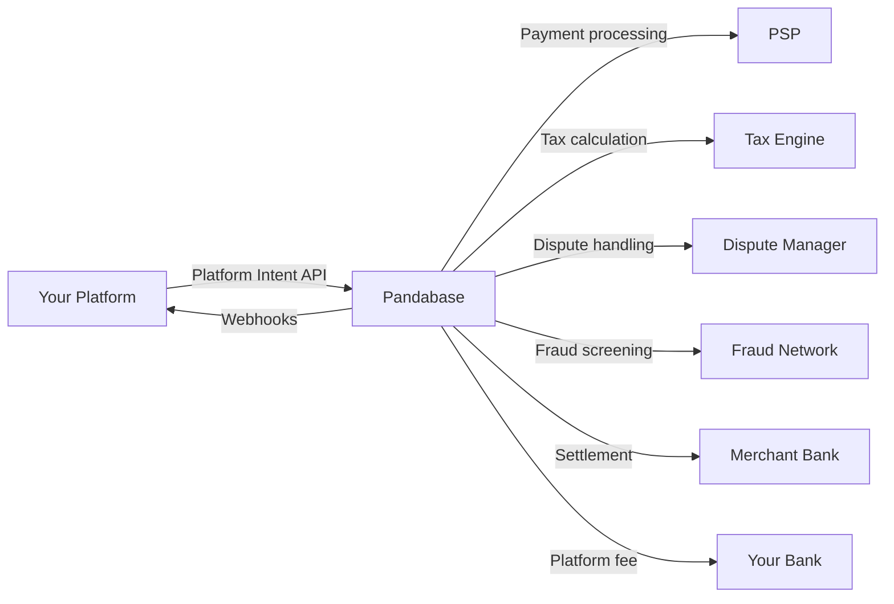

<Warning>
  The Platforms program is in **private beta**. Access requires approval from
  our partnerships team. Email
  [platforms@pandabase.io](mailto:platforms@pandabase.io) to apply.
</Warning>

## What is the Platform API?

The Platform API lets SaaS platforms, marketplaces, and commerce tools use Pandabase as their payment infrastructure. Instead of each merchant signing up individually, your platform manages their entire payment lifecycle through a single integration.

You handle the product experience. Pandabase handles payments, tax, disputes, and compliance.

## How it works

<Steps>
  <Step title="Register as a Platform Partner">
    Apply for the Platforms program and receive scoped credentials after
    completing compliance and technical review.
  </Step>
  <Step title="Provision merchants">
    Create merchant sub-accounts via the API as sellers onboard to your
    platform. Pandabase runs KYB checks and activates payment capabilities
    automatically.
  </Step>
  <Step title="Create Platform Intents">
    When a customer buys something on your platform, create a Platform Intent
    specifying the amount, merchant, and your platform fee. The customer pays
    through Pandabase.js or the hosted payment page.
  </Step>
  <Step title="Receive webhooks">
    Get real-time notifications for every event in the payment lifecycle:
    completions, failures, refunds, disputes, and settlements.
  </Step>
  <Step title="Funds settle automatically">
    Merchant payouts happen on a T+2 schedule. Your platform fees accumulate and
    are paid out weekly.
  </Step>
</Steps>

## Why use Platforms?

| Without Platforms                               | With Platforms                                       |
| ----------------------------------------------- | ---------------------------------------------------- |
| Each merchant signs up for Pandabase separately | You onboard merchants via API in seconds             |
| Merchants manage their own dashboard            | You control the full experience                      |
| No platform-level reporting                     | Unified analytics across all merchants               |
| No fee splitting                                | Automatic platform fee on every transaction          |
| Merchants handle disputes individually          | Pandabase handles disputes as MoR                    |
| No cross-merchant fraud detection               | Network-wide fraud signals across your merchant base |

## Platform credentials

Your platform receives three credential sets upon approval:

| Credential                | Prefix | Purpose                                      |
| ------------------------- | ------ | -------------------------------------------- |
| Platform ID               | `plt_` | Identifies your platform in all API requests |
| Platform Secret           | `psk_` | Signs API requests using HMAC-SHA512         |
| Merchant Provisioning Key | `mpk_` | Creates and manages merchant sub-accounts    |

All credentials are environment-specific. Sandbox and production credentials are issued separately and cannot be used interchangeably.

## Architecture



## Core concepts

### Platform Intents

A Platform Intent represents a payment your platform wants to collect on behalf of a merchant. It is the central object in the Platform API. Each intent tracks the full lifecycle from creation through settlement, including fee breakdowns, customer data, and webhook delivery.

### Merchants

Merchants are sub-accounts provisioned by your platform. Each merchant maps to an underlying Pandabase store with its own capabilities, volume limits, and compliance status. You control which capabilities each merchant has access to.

### Settlements

When a Platform Intent completes, the funds enter a settlement pipeline. After a compliance hold period, the merchant's share is paid out to their bank account. Your platform fees accumulate and settle weekly.

### Compliance

As a Platform Partner, you share compliance responsibilities with Pandabase. Your platform is responsible for merchant due diligence, transaction monitoring, and dispute evidence SLAs. Pandabase handles payment processing, tax remittance, sanctions screening, and customer KYC.

## Guides

<CardGroup cols={2}>
  <Card title="Merchants" icon="users" href="/platforms/merchants">
    Provision and manage merchant sub-accounts on your platform.
  </Card>
  <Card title="Platform Intents" icon="credit-card" href="/platforms/intents">
    Create and manage payment intents on behalf of merchants.
  </Card>
  <Card
    title="Settlements"
    icon="building-columns"
    href="/platforms/settlements"
  >
    Settlement timing, fee distribution, and payout schedules.
  </Card>
  <Card title="Compliance" icon="shield-check" href="/platforms/compliance">
    Requirements for maintaining Platform Partner status.
  </Card>
</CardGroup>

## Rate limits

Platform endpoints have separate rate limits from the standard Store API:

| Endpoint              | Limit               |
| --------------------- | ------------------- |
| Create intent         | 100/s per platform  |
| Read intent           | 300/s per platform  |
| Merchant provisioning | 10/min per platform |
| Merchant updates      | 30/min per platform |
| Settlement queries    | 30/s per platform   |
| Webhook management    | 10/min per platform |

Rate limit headers are included in every response:

```
X-RateLimit-Limit: 100
X-RateLimit-Remaining: 97
X-RateLimit-Reset: 1679000060
```

## Sandbox environment

Sandbox credentials are provided upon platform approval. The sandbox mirrors production with the following differences:

- No real charges are processed
- Settlement is simulated and completes instantly
- Merchant provisioning is auto-approved regardless of tier
- Rate limits are relaxed to 10x production limits
- Test card numbers are available for simulating various payment outcomes

```
Sandbox API: https://api.sandbox.pandabase.io/v2/platforms
Sandbox JS:  https://js.sandbox.pandabase.io/v2/platform.js
```

### Test cards

| Card Number           | Behavior                          |
| --------------------- | --------------------------------- |
| `4242 4242 4242 4242` | Successful payment                |
| `4000 0000 0000 0002` | Card declined                     |
| `4000 0000 0000 9995` | Insufficient funds                |
| `4000 0000 0000 0069` | Triggers a dispute after 24 hours |
| `4000 0000 0000 3220` | Requires 3D Secure authentication |

Use any future expiry date and any 3-digit CVC.

## Requirements

To qualify for the Platforms program:

- **Minimum GMV**: $10,000/month in expected payment volume
- **Merchant count**: At least 5 merchants on your platform
- **Legal entity**: Registered business in a [supported country](/guides/payouts)
- **Technical capacity**: Engineering team capable of completing the API integration
- **Compliance**: Existing KYC/AML procedures for merchant onboarding

## Getting started

<Steps>
  <Step title="Apply">
    Email [platforms@pandabase.io](mailto:platforms@pandabase.io) with your
    platform name, URL, expected monthly GMV, number of merchants, integration
    timeline, and a technical contact.
  </Step>
  <Step title="Complete the application">
    Fill out the platform application form and compliance questionnaire sent
    after initial review.
  </Step>
  <Step title="Technical review">
    Schedule an architecture review call with our integrations team to discuss
    your integration design.
  </Step>
  <Step title="Sandbox access">
    Receive sandbox credentials and begin building your integration.
  </Step>
  <Step title="Certification">
    Complete the production certification checklist to verify your integration
    handles all lifecycle events correctly.
  </Step>
  <Step title="Go live">
    Receive production credentials and start processing real payments.
  </Step>
</Steps>

<Note>
  The review process typically takes 5 to 10 business days. Platforms processing
  over $100K/month in GMV may be eligible for expedited review.
</Note>
