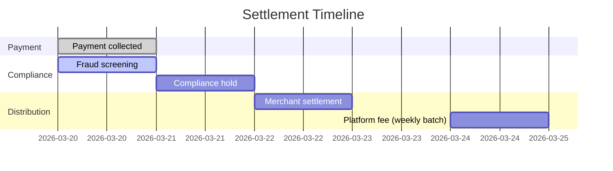

<Warning>
  Platform Settlements is in **private beta**. Requires an approved Platform
  Partner account.
</Warning>

## Overview

When a Platform Intent is completed, the funds enter a structured settlement pipeline. Pandabase handles the full lifecycle: collecting from the customer, holding funds during the compliance window, distributing the merchant's share to their bank account, and accumulating your platform fees for weekly payout.

## Settlement timeline



| Day    | Event               | Description                                                    |
| ------ | ------------------- | -------------------------------------------------------------- |
| T+0    | Payment collected   | Customer pays via Platform Intent                              |
| T+0    | Fraud screening     | Automated fraud and risk analysis runs against the transaction |
| T+1    | Compliance hold     | 24-hour hold window for early fraud alerts and dispute signals |
| T+2    | Merchant settlement | Funds released to the merchant's bank account                  |
| Weekly | Platform fee payout | Your accumulated platform fees are paid out every Monday       |

<Note>
  Settlement timing may be extended for merchants in `RESTRICTED` status or
  during active compliance investigations. High-risk transactions may be held
  for up to 7 days before release.
</Note>

### Settlement schedule exceptions

| Condition                              | Effect                                                   |
| -------------------------------------- | -------------------------------------------------------- |
| Merchant in `RESTRICTED` status        | Settlements held until restriction is lifted             |
| Transaction flagged by fraud screening | Held for manual review (up to 7 days)                    |
| Active compliance investigation        | All settlements held until investigation concludes       |
| Bank holidays                          | Settlement pushed to next business day                   |
| Failed bank transfer                   | Retried automatically up to 3 times over 5 business days |

## Fee distribution

For every Platform Intent, funds are split between three parties: Pandabase, your platform, and the merchant.

### Example: $50.00 transaction with $5.00 platform fee

| Component                        | Amount | Recipient     |
| -------------------------------- | ------ | ------------- |
| Customer pays                    | $50.00 |               |
| Pandabase MoR fee (5.9% + $0.20) | $3.15  | Pandabase     |
| Platform fee                     | $5.00  | Your platform |
| Merchant receives                | $41.85 | Merchant      |

### Example: $10.00 transaction with $1.00 platform fee

| Component                        | Amount | Recipient     |
| -------------------------------- | ------ | ------------- |
| Customer pays                    | $10.00 |               |
| Pandabase MoR fee (5.9% + $0.20) | $0.79  | Pandabase     |
| Platform fee                     | $1.00  | Your platform |
| Merchant receives                | $8.21  | Merchant      |

The fee breakdown is included in the intent response at creation time, so both you and the merchant know the exact split before the customer pays.

## Querying settlements

### List merchant settlements

```bash
GET /v2/platforms/settlements?merchantId=shp_xxx&status=COMPLETED&from=2026-03-01&to=2026-03-31
Authorization: Platform plt_xxx
X-Platform-Signature: {signature}
```

### Query parameters

| Parameter    | Type    | Default | Description                                                               |
| ------------ | ------- | ------- | ------------------------------------------------------------------------- |
| `merchantId` | string  |         | Filter by merchant. If omitted, returns settlements across all merchants. |
| `status`     | string  | All     | Filter by settlement status                                               |
| `from`       | string  |         | Start date (ISO 8601)                                                     |
| `to`         | string  |         | End date (ISO 8601)                                                       |
| `page`       | integer | 1       | Page number                                                               |
| `limit`      | integer | 25      | Items per page (max 100)                                                  |

### Response

```json
{
  "ok": true,
  "data": {
    "items": [
      {
        "id": "stl_xxx",
        "intentId": "pti_xxx",
        "merchantId": "shp_xxx",
        "grossAmount": 4999,
        "pandabaseFee": 315,
        "platformFee": 500,
        "netAmount": 4184,
        "status": "COMPLETED",
        "initiatedAt": "2026-03-22T06:00:00.000Z",
        "settledAt": "2026-03-22T08:00:00.000Z",
        "reference": "po_xxx"
      }
    ],
    "pagination": {
      "page": 1,
      "limit": 25,
      "total": 142,
      "totalPages": 6
    },
    "summary": {
      "totalGross": 665000,
      "totalSettled": 595000,
      "totalPlatformFees": 71000,
      "totalPandabaseFees": 39200,
      "transactionCount": 142
    }
  }
}
```

The `summary` object provides aggregate totals for the filtered result set. Use it for reporting and reconciliation without needing to sum individual records.

### Settlement statuses

| Status       | Description                                                              |
| ------------ | ------------------------------------------------------------------------ |
| `PENDING`    | Payment collected, currently in the compliance hold period               |
| `PROCESSING` | Settlement initiated, funds are being transferred to the merchant's bank |
| `COMPLETED`  | Funds successfully delivered to the merchant                             |
| `HELD`       | Settlement held for investigation or due to merchant restriction         |
| `FAILED`     | Settlement failed (bank rejection, invalid account details, etc.)        |

### Retrieving a single settlement

```bash
GET /v2/platforms/settlements/{settlementId}
Authorization: Platform plt_xxx
X-Platform-Signature: {signature}
```

Response:

```json
{
  "ok": true,
  "data": {
    "id": "stl_xxx",
    "intentId": "pti_xxx",
    "merchantId": "shp_xxx",
    "grossAmount": 4999,
    "pandabaseFee": 315,
    "platformFee": 500,
    "netAmount": 4184,
    "status": "COMPLETED",
    "bankAccount": {
      "last4": "7890",
      "bankName": "Chase",
      "type": "ACH"
    },
    "timeline": [
      {
        "status": "PENDING",
        "timestamp": "2026-03-20T12:05:00.000Z"
      },
      {
        "status": "PROCESSING",
        "timestamp": "2026-03-22T06:00:00.000Z"
      },
      {
        "status": "COMPLETED",
        "timestamp": "2026-03-22T08:00:00.000Z"
      }
    ],
    "initiatedAt": "2026-03-22T06:00:00.000Z",
    "settledAt": "2026-03-22T08:00:00.000Z",
    "reference": "po_xxx"
  }
}
```

## Platform fee payouts

Your platform fees accumulate across all merchant transactions and are paid out every Monday to your registered bank account.

### Querying platform payouts

```bash
GET /v2/platforms/payouts?from=2026-03-01&to=2026-03-31
Authorization: Platform plt_xxx
X-Platform-Signature: {signature}
```

### Query parameters

| Parameter | Type    | Default | Description                                                             |
| --------- | ------- | ------- | ----------------------------------------------------------------------- |
| `status`  | string  | All     | Filter by payout status: `PENDING`, `PROCESSING`, `COMPLETED`, `FAILED` |
| `from`    | string  |         | Start date (ISO 8601)                                                   |
| `to`      | string  |         | End date (ISO 8601)                                                     |
| `page`    | integer | 1       | Page number                                                             |
| `limit`   | integer | 25      | Items per page (max 100)                                                |

### Response

```json
{
  "ok": true,
  "data": {
    "items": [
      {
        "id": "ppay_xxx",
        "amount": 15400,
        "transactionCount": 87,
        "periodStart": "2026-03-11T00:00:00.000Z",
        "periodEnd": "2026-03-17T23:59:59.000Z",
        "status": "COMPLETED",
        "paidAt": "2026-03-18T08:00:00.000Z",
        "bankAccount": {
          "last4": "1234",
          "bankName": "Silicon Valley Bank",
          "type": "ACH"
        }
      }
    ],
    "pagination": {
      "page": 1,
      "limit": 25,
      "total": 12,
      "totalPages": 1
    }
  }
}
```

### Minimum payout threshold

Platform fee payouts require a minimum accumulated balance of **$25.00**. If your fees are below this threshold at the Monday payout cutoff, they roll over to the next cycle.

### Payout schedule

| Day                 | Action                                                                      |
| ------------------- | --------------------------------------------------------------------------- |
| Monday 00:00 UTC    | Payout cutoff. All fees accumulated since the last cutoff are included.     |
| Monday 06:00 UTC    | Payout initiated to your bank account.                                      |
| Monday to Wednesday | Funds arrive depending on your bank and transfer method (ACH, SEPA, SWIFT). |

## Refunds and disputes

When a refund or dispute occurs on a Platform Intent, the financial impact flows through the settlement pipeline.

### Refunds

- The refund amount is deducted from the merchant's available balance
- The Pandabase MoR fee is **not** returned on refund
- Platform fee refund behavior is configurable per platform. By default, your platform fee is **not** refunded. Contact [platforms@pandabase.io](mailto:platforms@pandabase.io) to change this.
- If the merchant's balance is insufficient, the refund is queued until balance is available

### Disputes

- The disputed amount plus the **$20 dispute fee** is deducted from the merchant's balance immediately
- If the merchant's balance is insufficient, the deficit is deducted from your next platform fee payout
- If the dispute is won, both the disputed amount and the $20 fee are restored to the merchant's balance
- If the dispute is lost, the deductions are permanent

### Dispute liability waterfall

When a merchant's balance cannot cover a dispute, the liability cascades:

| Priority | Source              | Description                                          |
| -------- | ------------------- | ---------------------------------------------------- |
| 1        | Merchant balance    | Deducted first from the merchant's available balance |
| 2        | Pending settlements | Held settlements for the merchant are applied        |
| 3        | Platform fee offset | Deficit deducted from your next platform fee payout  |
| 4        | Platform reserve    | If enabled, drawn from your platform reserve balance |

<Warning>
  Platforms with an aggregate dispute rate exceeding 1% across all merchants may
  be placed under review. Monitor your merchants' dispute rates through the
  settlements API or the platform dashboard.
</Warning>

## Settlement webhooks

| Event                        | Description                                               |
| ---------------------------- | --------------------------------------------------------- |
| `SETTLEMENT_PENDING`         | Payment completed, settlement entered the compliance hold |
| `SETTLEMENT_PROCESSING`      | Settlement initiated to merchant's bank account           |
| `SETTLEMENT_COMPLETED`       | Funds delivered to merchant                               |
| `SETTLEMENT_FAILED`          | Settlement failed (bank rejection, invalid details)       |
| `SETTLEMENT_HELD`            | Settlement held for investigation                         |
| `SETTLEMENT_RELEASED`        | Previously held settlement released for processing        |
| `PLATFORM_PAYOUT_PROCESSING` | Weekly platform fee payout initiated                      |
| `PLATFORM_PAYOUT_COMPLETED`  | Platform fee payout delivered to your bank                |
| `PLATFORM_PAYOUT_FAILED`     | Platform fee payout failed                                |

### Example webhook payload

```json
{
  "event": "SETTLEMENT_COMPLETED",
  "platformId": "plt_xxx",
  "merchantId": "shp_xxx",
  "timestamp": "2026-03-22T08:00:00.000Z",
  "data": {
    "settlementId": "stl_xxx",
    "intentId": "pti_xxx",
    "grossAmount": 4999,
    "pandabaseFee": 315,
    "platformFee": 500,
    "netAmount": 4184,
    "bankAccount": {
      "last4": "7890"
    }
  }
}
```

## Reconciliation

For end-of-period reconciliation, use the settlement list endpoint with date range filters. The `summary` object in the response provides pre-calculated totals.

To reconcile your platform fee payouts against individual settlements:

1. Query settlements for the payout period using `from` and `to` parameters
2. Sum the `platformFee` field across all `COMPLETED` settlements
3. This total should match the `amount` field on the corresponding platform payout

If there is a discrepancy, check for:

- Disputes that offset your platform fee during the period
- Refunds with platform fee clawback enabled
- Settlements in `HELD` or `FAILED` status that were excluded from the payout

## Error codes

| Code                   | Status | Description                                |
| ---------------------- | ------ | ------------------------------------------ |
| `SETTLEMENT_NOT_FOUND` | 404    | No settlement found with the given ID      |
| `PAYOUT_NOT_FOUND`     | 404    | No platform payout found with the given ID |
| `INVALID_DATE_RANGE`   | 400    | The `from` date is after the `to` date     |
